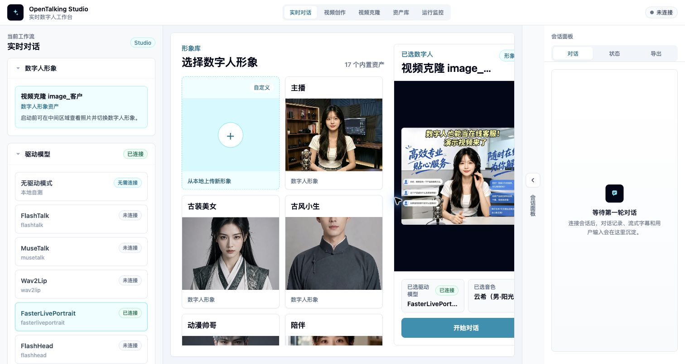
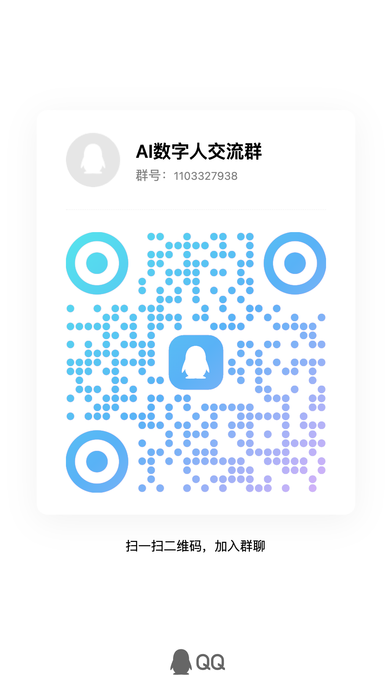

<h1 align="center">OpenTalking</h1>

<p align="center">
  <b>リアルタイム・デジタルヒューマン向けオープンソースパイプライン：LLM、TTS、WebRTC、キャラクターボイス、プラグイン可能なモデルバックエンド</b>
</p>

<p align="center">
  <a href="./README.md">English</a> ·
  <a href="./README.zh.md">中文</a> ·
  <a href="./README.ja.md">日本語</a> ·
  <a href="https://datascale-ai.github.io/opentalking/latest/en/">ドキュメント</a> ·
  <a href="https://github.com/datascale-ai/opentalking">GitHub</a>
</p>

<p align="center">
  <a href="LICENSE"></a>
  
  
  
  
</p>

<p align="center">
  <a href="https://www.opentalking.net/#github">
    
  </a>
</p>

<p align="center">
  <a href="#webui-とデモ">デモ</a> ·
  <a href="#デプロイ方法を選ぶ">デプロイ</a> ·
  <a href="#クイックスタート">クイックスタート</a> ·
  <a href="#対応モデル">モデル</a> ·
  <a href="#進捗とロードマップ">ロードマップ</a> ·
  <a href="#ドキュメントとコミュニティ">ドキュメントとコミュニティ</a>
</p>

---

## 概要

OpenTalking は、リアルタイムのデジタルヒューマン会話を実現するオープンソースのオーケストレーションフレームワークです。**デジタルヒューマン会話製品**の中核経路である、フロントエンド操作、セッション状態、LLM の応答、STT、TTS と音声の選択、割り込み制御、字幕イベント、WebRTC による音声・映像再生、ローカルまたはリモートのモデルサービス呼び出しを網羅します。

OpenTalking は、実用的なデジタルヒューマン制作スタックとして設計されています。WebUI、アバターと音声のアセットライブラリ、ナレッジベース、メモリ、マルチセッション状態、LLM / STT / TTS プロバイダー、WebRTC 再生、モデルバックエンドを一つのプロジェクトにまとめています。軽量な Mock モードから始め、ローカルの QuickTalk / Wav2Lip を接続したり、OmniRT を利用して FlashTalk、FasterLivePortrait など、より高品質または複雑なモデルワークフローを使用したりできます。

- **すぐに試す**：`mock / driverless mode`。動画モデルの重みをダウンロードする前に、API、TTS、WebRTC の経路を検証するのに適しています。
- **リアルタイム会話**：`QuickTalk`、`Wav2Lip`、`FlashTalk` などのモデルを接続し、対話型のデジタルヒューマン会話を実現します。
- **動画作成とクローン**：FasterLivePortrait runtime を再利用し、音声・テキスト駆動の動画作成や、カメラ・アップロード動画駆動の動画クローンを実現します。
- **プライベートデプロイ**：ローカル STT/TTS、OpenAI-compatible LLM、ナレッジベース、メモリ、OmniRT リモート推論、Docker、分散デプロイに対応します。

詳しいドキュメント：

- ドキュメントサイト：<https://datascale-ai.github.io/opentalking/latest/en/>
- 中国語ドキュメント：<https://datascale-ai.github.io/opentalking/latest/>

## WebUI とデモ

OpenTalking は、デジタルヒューマン会話パイプラインを管理する Web サービスインターフェースを提供します。アバターの選択・作成、音声、LLM、TTS、STT、デジタルヒューマン駆動モデルの設定、モデル接続状態の確認を行い、同じページ上でリアルタイム会話、字幕、音声・映像再生を検証できます。



### デモ動画

以下のデモは、リアルタイム会話、動画作成、動画クローンという三つの一般的なフロントエンドワークフローを紹介します。

<table width="100%" cellpadding="0" cellspacing="0">
  <tr>
    <th align="center" colspan="3">主な製品シナリオ</th>
  </tr>
  <tr>
    <td align="center" valign="top" width="33%">
      <b>医療案内</b><br/>
      <video src="https://github.com/user-attachments/assets/be67429b-b082-473f-a087-e3d1b8a1e9b4" controls preload="metadata" width="248" height="140"></video><br/>
    </td>
    <td align="center" valign="top" width="33%">
      <b>ライブコマース</b><br/>
      <video src="https://github.com/user-attachments/assets/a0aad157-5d0b-4196-9a82-4226b7b2c6c6" controls preload="metadata" width="248" height="140"></video><br/>
    </td>
    <td align="center" valign="top" width="33%">
      <b>黄山観光ガイド</b><br/>
      <video src="https://github.com/user-attachments/assets/7d620fe4-9e38-48a2-a3af-a26eae048ab4" controls preload="metadata" width="248" height="140"></video><br/>
    </td>
  </tr>
</table>

<table width="100%" cellpadding="0" cellspacing="0">
  <tr>
    <th align="center" colspan="3">A. リアルタイム会話</th>
  </tr>
  <tr>
    <td align="center" valign="top" width="33%">
      <b>E コマース配信</b><br/>
      <video src="https://github.com/user-attachments/assets/4646f29d-f773-4f95-84a9-8128ea97ac14" controls preload="metadata" width="248" height="441"></video><br/>
    </td>
    <td align="center" valign="top" width="33%">
      <b>コンパニオンキャラクター</b><br/>
      <video src="https://github.com/user-attachments/assets/6e80d2ac-36a0-41bb-8394-26e0c1121cb6" controls preload="metadata" width="248" height="441"></video><br/>
    </td>
    <td align="center" valign="top" width="33%">
      <b>ニュースキャスター</b><br/>
      <video src="https://github.com/user-attachments/assets/ff7ba86b-927a-46f9-91a6-cfed5d332bda" controls preload="metadata" width="248" height="441"></video><br/>
    </td>
  </tr>
</table>

<table width="100%" cellpadding="0" cellspacing="0">
  <tr>
    <th align="center" colspan="3">B. 動画作成</th>
  </tr>
  <tr>
    <td align="center" valign="top" width="33%">
      <b>音声駆動</b><br/>
      <video src="https://github.com/user-attachments/assets/d2b93d0c-2ee6-409f-84d9-79d109d8592c" controls preload="metadata" width="248" height="140"></video><br/>
    </td>
    <td align="center" valign="top" width="33%">
      <b>テキスト駆動</b><br/>
      <video src="https://github.com/user-attachments/assets/d1d4df8d-c599-4c6d-b61c-eec361e9556c" controls preload="metadata" width="248" height="140"></video><br/>
    </td>
    <td align="center" valign="top" width="33%">
      <b>クローン音声駆動</b><br/>
      <video src="https://github.com/user-attachments/assets/87b3efc4-d54a-4d2a-8d70-c37834154518" controls preload="metadata" width="248" height="140"></video><br/>
    </td>
  </tr>
</table>

<table width="100%" cellpadding="0" cellspacing="0">
  <tr>
    <th align="center" colspan="2">C. 動画クローン</th>
  </tr>
  <tr>
    <td align="center" valign="top" width="50%">
      <b>カメラによるリアルタイム模倣</b><br/>
      <video src="https://github.com/user-attachments/assets/cd8c9e7b-66a6-46c8-b6c8-61632ce1a712" controls preload="metadata" width="386" height="217"></video><br/>
    </td>
    <td align="center" valign="top" width="50%">
      <b>アップロード動画の模倣</b><br/>
      <video src="https://github.com/user-attachments/assets/5e8a5ae9-e39e-48ee-8c41-930369edc6b4" controls preload="metadata" width="386" height="217"></video><br/>
    </td>
  </tr>
</table>

## デプロイ方法を選ぶ

OpenTalking の **オーケストレーション層**（API / Worker / フロントエンド）と **デジタルヒューマン合成バックエンド**（`mock`、`local`、`direct_ws`、または [OmniRT](https://github.com/datascale-ai/omnirt)）は、個別にデプロイできます。初めて利用する場合は、まず Mock モードで経路全体を検証し、その後 GPU、モデル、プライベートデプロイの要件に応じて実際のレンダリングモデルへ切り替えてください。

| 経路 | 推奨モデル / バックエンド | デバイスの目安 | 適した用途 | 詳細 |
| --- | --- | --- | --- | --- |
| すぐに試す | `mock` | CPU / GPU 不要 | モデルの重みをダウンロードせずに API、LLM、TTS、WebRTC、ブラウザー再生を検証 | [クイックスタート](https://datascale-ai.github.io/opentalking/latest/en/quick-start/) |
| 導入検証 | `quicktalk` / `wav2lip` | RTX 3050 Laptop、RTX 3060、RTX 4060 | デモやデプロイ検証で実際の動画レンダリングを実行。低メモリのデバイスでは解像度を下げる | [QuickTalk](https://datascale-ai.github.io/opentalking/latest/en/avatar_models/deployment/quicktalk-local/) / [Wav2Lip](https://datascale-ai.github.io/opentalking/latest/en/avatar_models/deployment/wav2lip-local/) |
| コンシューマー GPU の単一マシン | `quicktalk` / `wav2lip` / `musetalk` | RTX 3090、RTX 4090 | リアルタイムに近いローカルデモ、プライベート検証、軽量な本番前評価 | [モデルとバックエンドの選択](https://datascale-ai.github.io/opentalking/latest/en/model-support/selection/) |
| 完全ローカルのプライベート経路 | `sensevoice` + `local_cosyvoice` + `quicktalk` | RTX 3090 / 4090 または同等の GPU | STT、TTS、動画駆動をローカルで実行。OpenTalking はメインの `.venv`、CosyVoice は専用の sidecar venv を使用 | [ローカル STT/TTS + QuickTalk](https://datascale-ai.github.io/opentalking/latest/en/recipes/local-quicktalk-audio/) |
| 高品質なリモート推論 | `flashtalk` / `flashhead` / `fasterliveportrait` + OmniRT | マルチ GPU、Ascend 910B2、リモート GPU サービス | マルチカード、GPU/NPU、本番環境の分離、高画質、動画クローンのワークフロー | [FlashTalk](https://datascale-ai.github.io/opentalking/latest/en/avatar_models/flashtalk/) / [FasterLivePortrait](https://datascale-ai.github.io/opentalking/latest/en/avatar_models/fasterliveportrait/) |
| Docker / 本番デプロイ | API、Web、Worker、外部モデルサービス | 単一 GPU、リモート GPU、分散クラスター | サービスデプロイ、リモート GPU、分散 runtime、本番環境の検証 | [デプロイ](https://datascale-ai.github.io/opentalking/latest/en/deployment/) |

## クイックスタート

まず、次の二つからクイックスタートの経路を選びます。

| 経路 | 使用する場面 | 必要なもの | 検証できる内容 |
| --- | --- | --- | --- |
| Compshare イメージ | 依存関係のセットアップやモデルの重みのダウンロード前に OpenTalking を試したい場合。 | 公開済みイメージから作成した Compshare インスタンスと、開放したポート `5173`。 | WebUI、LLM の応答、ストリーミング TTS、字幕イベント、WebRTC 配信、ビルド済みイメージのワークフロー。 |
| セルフデプロイ | 自分のマシンやサーバーでリポジトリを実行し、設定をカスタマイズする場合、またはローカル・リモートモデルのデプロイへ進む場合。 | Python、Node.js、FFmpeg、`.env` のプロバイダー設定。実モデルには GPU、runtime、モデルの重みも必要。 | Mock の初回実行経路、その後のローカル QuickTalk またはリモート OmniRT モデル経路。 |

### 1. Compshare イメージ

すべてを手動でセットアップする前に、OpenTalking + OmniRT + QuickTalk のリアルタイム・デジタルヒューマン経路を試すには、Compshare で公開しているコミュニティイメージを使用してください。

- イメージ URL：[イメージへのリンク](https://www.compshare.cn/images/TdDwmKZUZebI?referral_code=Hid5KUhcqlZEptmMEwKy2F)
- ガイド：[Compshare イメージのクイック体験](https://datascale-ai.github.io/opentalking/latest/en/quick-start/)

このイメージには、OpenTalking、OmniRT、QuickTalk runtime 環境、モデルファイルが含まれています。インスタンスをデプロイした後、ポート `5173` を開き、プラットフォームが提供するインスタンス URL にアクセスします。サービスを手動で再起動する必要がある場合は、ガイドのコマンドに従ってください。

### 2. セルフデプロイ

OpenTalking をソースから実行する場合に使用します。まだ動画モデルの重みをダウンロードしたくない場合は、Mock モードから始めてください。Mock モードでは内蔵の静止フレームを使用しますが、LLM の応答、ストリーミング TTS、字幕イベント、WebRTC 配信は製品の全経路を通ります。

```bash
git clone https://github.com/datascale-ai/opentalking.git
cd opentalking

uv sync --extra dev --python 3.11
source .venv/bin/activate
cp .env.example .env
```

`.env` を編集し、少なくとも一つの LLM を設定します。デフォルトの TTS ではキー不要の `edge` 音声を使用できます。LLM、STT、TTS は独立したプロバイダーです。詳しくは [設定](https://datascale-ai.github.io/opentalking/latest/en/reference/configuration/) と [LLM / STT](https://datascale-ai.github.io/opentalking/latest/en/speech_models/llm-stt/) を参照してください。

```bash
bash scripts/start_unified.sh --mock
```

デフォルトのフロントエンド URL は `http://localhost:5173` です。ポートを指定するには、次を実行します。

```bash
bash scripts/start_unified.sh --mock --api-port 8210 --web-port 5280
```

サービスを停止します。

```bash
bash scripts/quickstart/stop_all.sh
```

#### 実モデルのエントリーポイント

Mock モードが動作したら、マシンの条件に応じて実モデルの経路を選びます。重みのダウンロード、ディレクトリ構成、ミラー、チェック、トラブルシューティングはドキュメントで管理し、README には起動エントリーポイントだけを掲載しています。

```bash
# ローカル QuickTalk：コンシューマー GPU の単一マシン経路
export DIGITAL_HUMAN_HOME="${DIGITAL_HUMAN_HOME:-$HOME/digital-human}"
export OPENTALKING_MODEL_ROOT="${OPENTALKING_MODEL_ROOT:-$DIGITAL_HUMAN_HOME/models}"
export OPENTALKING_TORCH_DEVICE=cuda:0
export OPENTALKING_QUICKTALK_ASSET_ROOT="$OPENTALKING_MODEL_ROOT/quicktalk"
export OPENTALKING_QUICKTALK_WORKER_CACHE=1
bash scripts/start_unified.sh --backend local --model quicktalk --api-port 8210 --web-port 5280

# リモート OmniRT / FlashTalk：高品質またはマルチカードの経路
bash scripts/start_unified.sh \
  --backend omnirt \
  --model flashtalk \
  --api-port 8210 \
  --web-port 5280 \
  --omnirt http://<gpu-server>:9000
```

その他のエントリーポイント：

- [QuickTalk のローカルデプロイ](https://datascale-ai.github.io/opentalking/latest/en/avatar_models/deployment/quicktalk-local/)
- [Wav2Lip のローカルデプロイ](https://datascale-ai.github.io/opentalking/latest/en/avatar_models/deployment/wav2lip-local/)
- [FasterLivePortrait / JoyVASA](https://datascale-ai.github.io/opentalking/latest/en/avatar_models/fasterliveportrait/)
- [動画クローンガイド](https://datascale-ai.github.io/opentalking/latest/en/usage/webui/video-clone/)
- [WebUI ガイド](https://datascale-ai.github.io/opentalking/latest/en/usage/webui/basic/)
- [Docker Compose と本番デプロイ](https://datascale-ai.github.io/opentalking/latest/en/deployment/)

## 対応モデル

| モデル | 入力 | 推奨バックエンド | リソースの目安 |
| --- | --- | --- | --- |
| `mock` | 参照画像 / 静止フレーム | `mock` | GPU 不要 |
| `quicktalk` | テンプレート動画 + 音声 | `local` | CUDA GPU、RTX 3090 / 4090 推奨 |
| `wav2lip` | 参照画像 / フレーム + 音声 | `local` / `omnirt` | GPU / NPU メモリ `>= 8 GB` |
| `musetalk` | 全フレーム + 音声 | `omnirt` / `local` | GPU メモリ `>= 12 GB` |
| `soulx-flashtalk-14b` | ポートレート + 音声 | `omnirt` | マルチ GPU / NPU |
| `soulx-flashhead-1.3b` | ポートレート + 音声 | `omnirt` | マルチ GPU / NPU |
| `fasterliveportrait` | ポートレート / 駆動動画 / 音声 | `omnirt` | 単一 GPU によるリアルタイムのポートレート合成、動画作成、動画クローン |

### コンシューマー GPU の目安

| モデル | ハードウェア | 入力 | 出力 | VRAM | スループット |
| --- | --- | --- | --- | --- | --- |
| `quicktalk` | RTX 3090 | テンプレート動画 + 音声 | 720x900 / 25fps | 約 3.8 GiB | 約 35 fps |

重みのダウンロード、Docker、トラブルシューティング、モデル設定については、[モデルのデプロイ](https://datascale-ai.github.io/opentalking/latest/en/model-deployment/) を参照してください。

### クラウドモデル API：Atlas Cloud

<p align="center">
  <a href="https://www.atlascloud.ai/?utm_source=github&utm_medium=link&utm_campaign=opentalking">
    
  </a>
</p>

> **[Atlas Cloud](https://www.atlascloud.ai/?utm_source=github&utm_medium=link&utm_campaign=opentalking)** は、全モーダル対応の AI 推論プラットフォームです。一つの API から動画生成、画像生成、LLM を利用できるため、複数のベンダーを個別に統合する必要がありません。一度統合すれば、厳選された 300 以上の全モーダルモデルへルーティングできます。

OpenTalking の LLM は OpenAI-compatible インターフェースを使用します。Atlas がホストする DeepSeek / Qwen モデルを利用するには、`OPENTALKING_LLM_BASE_URL` を `https://api.atlascloud.ai/v1` に設定します。詳しくは [LLM と STT](https://datascale-ai.github.io/opentalking/latest/en/speech_models/llm-stt/) を参照してください。低予算向けの API オプションについては、Atlas Cloud の [coding plan](https://www.atlascloud.ai/console/coding-plan) を参照してください。

## 進捗とロードマップ

- [ ] **より自然なリアルタイム会話**
  割り込み処理、低遅延応答、音声・映像同期、長時間セッションの復旧、runtime の可視性を改善します。

- [ ] **コンシューマー GPU のマルチモデル経路**
  QuickTalk / Wav2Lip / MuseTalk のローカル経路について、アセットチェック、事前ウォームアップ、キャッシュ再利用、低メモリ向けパラメーター、RTX 3090 / 4090 / WSL2 のベンチマークを改善し、FasterLivePortrait の動画作成・動画クローン測定値をさらに充実させます。

- [ ] **Windows / WSL2 のワンコマンドデプロイ**
  現在の Windows ドキュメントとテスト記録を基に、モデルのダウンロード、runtime のインストール、環境チェック、診断の導入障壁をさらに下げます。

- [ ] **高品質なプライベートデプロイ**
  外部 OmniRT 推論サービス、マルチモデルエンドポイント、容量スケジューリング、ヘルスチェック、本番監視、GPU / NPU デプロイガイダンスを改善します。

- [ ] **クラウド音声・マルチモーダルプロバイダーの拡充**
  現在の OpenAI-compatible、DashScope、Xiaomi MiMo プロファイルを基盤として、プラグイン可能な STT / TTS / LLM プロバイダー、統一されたフロントエンド選択、プロバイダー単位のヘルスチェックを拡充します。

- [ ] **Agent、メモリ、プラットフォーム機能**
  アセットライブラリ、ナレッジベース、メモリ、マルチセッションスケジューリング、ツール呼び出し、OpenClaw / 外部 Agent 連携を製品化し、可観測性、安全性、ライセンス済み音声、合成コンテンツのラベル付けを整備します。

### 最近の進捗

- **2026-06-25：WeChat メモリのインポートとペルソナワークフロー**
  WeChat メモリからのペルソナインポート、ドキュメント、関連するペルソナワークフローを追加しました。フロントエンドでは、ペルソナ選択と駆動モデル選択を排他的に扱わなくなり、インポートしたメモリ・ペルソナのコンテキストと選択したアバタードライバーを組み合わせられます。

- **2026-06-23：ローカル CosyVoice TRT sidecar デプロイ**
  TensorRT / FP16 高速化の説明、runtime チューニング、専用環境の分離、起動チェック、ローカル TTS と QuickTalk を組み合わせるための実測デプロイガイドを含む、ローカル CosyVoice sidecar のデプロイ経路を追加しました。

- **2026-06-22：runtime 設定、メモリ更新、没入型シーン**
  runtime API 設定ページを追加し、runtime 更新時の mem0 プロバイダー解放を改善しました。また、シーンアセット API、アセットライブラリ連携、没入型会話モード、シーン・アバターのアンカー、透過背景処理、ビュー切り替え時のリアルタイムメディア保持を含むシーンアセットパイプラインを拡張しました。

- **2026-06-18/19：クイックスタートの分割、LightRAG runtime 設定、シナリオガイド**
  クイックスタートを Compshare イメージとセルフデプロイの経路に分割し、LightRAG runtime 設定とクイックスタートの更新、mem0 / Hugging Face ダウンロードツールの依存関係に関する説明の修正、黄山デジタルヒューマンガイドの追加を行いました。

- **2026-06-12：QuickTalk ローカルアセットの修正と Apple Silicon 対応**
  QuickTalk のローカル重み、HuBERT、InsightFace のパス、欠落アセットのチェック、キャッシュ準備、ヘルスチェックを整理しました。macOS arm64 で MPS / CPU を使用して `quicktalk-cpu` を検証するための Apple Silicon デプロイドキュメントを追加しました。

- **2026-06-12：IndexTTS、QuickTalk、FlashTalk の動画作成改善**
  ローカル IndexTTS と OmniRT IndexTTS のプロバイダー、システム音声、音声プレビュー、音声ラベルを追加しました。QuickTalk / IndexTTS の動画作成経路を改善し、デフォルトの参照ドライバーを備えた FlashTalk の参照動画生成を追加しました。

- **2026-06-02/10：Persona Package、ナレッジ検索、キャラクターメモリ**
  再利用可能な役割設定、ナレッジ資料、プロンプト向けの Persona Package API / CLI / WebUI エントリーポイントを追加しました。LightRAG ナレッジ検索、セッション単位のナレッジ選択、キャラクターメモリパネル、BM25 / mem0 / SQLite のメモリプロバイダーを追加しました。

- **2026-06-05：アセットライブラリとナレッジベースのワークフロー**
  WebUI のアセットライブラリを拡張し、アバターアセット、ナレッジ資料、セッション選択、Agent コンテキスト構築を連携しました。また、音声・動画のエクスポートを追加し、デモ、レビュー、再利用可能な素材を同じワークスペース内に保持できるようにしました。

- **2026-06-05/06：OpenAI-compatible 音声プロバイダーと MuseTalk デプロイの更新**
  OpenAI-compatible STT / TTS アダプター、Xiaomi MiMo STT / TTS / voice clone プロファイル、フロントエンドのプロバイダー選択、音声リストを追加しました。`.env.example` を LLM / STT / TTS の個別プロファイルテンプレートに再構成しました。併せて MuseTalk のローカル / OmniRT デプロイドキュメント、アセット準備スクリプト、クイックスタートスクリプトを改善しました。

- **2026-06-04：FasterLivePortrait の動画作成と動画クローン**
  FasterLivePortrait の動画作成パラメーターパネル、動画クローンページ、カスタムソースアセットのアップロード、カメラ・アップロード動画の駆動入力、ドキュメントのスクリーンショットを追加し、OmniRT + FasterLivePortrait runtime の経路を再利用しました。

- **2026-06-03：Web 録画のエクスポート、アセットライブラリ、動画ワークフロー**
  Web 録画のエクスポート、エクスポートストレージ、動画作成エントリーポイント、アセットライブラリのワークスペースを追加し、リアルタイム会話、素材管理、動画生成をつなぎました。

- **2026-06-12/13：ホームページ分析、GitHub トラフィック、デプロイドキュメント**
  英語ホームページ、デプロイ経路の表示、サイト分析、GitHub トラフィック統計、グラフスタイルの更新、統計期間の修正を追加しました。Windows デプロイ向けに WSL2 ネットワークモード選択ガイドを追加し、README のデモ動画とドキュメントサイトのリンクを継続的に更新しました。

- **以前からの基盤：リアルタイム会話経路とバックエンドの分離**
  Web コンソール、LLM 会話、TTS、字幕イベント、WebRTC の音声・映像再生、アバターの事前ウォームアップとキャッシュ、統一 audio2video runner、プラグイン可能な `mock` / `local` / `direct_ws` / `omnirt` モデルバックエンドを構築しました。

## ドキュメントとコミュニティ

- [クイックスタート](https://datascale-ai.github.io/opentalking/latest/en/quick-start/)
- [モデル](https://datascale-ai.github.io/opentalking/latest/en/model-deployment/)（重みのダウンロード、ミラー、起動、検証）
- [アーキテクチャ](https://datascale-ai.github.io/opentalking/latest/en/developer-guide/architecture/)
- [設定](https://datascale-ai.github.io/opentalking/latest/en/reference/configuration/)
- [デプロイ](https://datascale-ai.github.io/opentalking/latest/en/deployment/)（Docker Compose、分散デプロイ）
- [モデルアダプター](https://datascale-ai.github.io/opentalking/latest/en/developer-guide/model-adapter/)
- [コントリビューション](CONTRIBUTING.md)（開発環境、CLI ツール、ruff / mypy / pytest）

リアルタイム・デジタルヒューマン、FlashTalk、OmniRT、モデルのデプロイ、製品シナリオについて話し合うには、QQ または WeChat コミュニティにご参加ください。

<table align="center">
  <tr>
    <td align="center"><b>QQ</b></td>
    <td align="center"><b>WeChat</b><br><b>微信</b></td>
  </tr>
  <tr>
    <td align="center"></td>
    <td align="center"></td>
  </tr>
</table>

<p align="center">
  <b>AI デジタルヒューマンコミュニティ</b> · QQ グループ ID：<code>1103327938</code> · WeChat
</p>

## 謝辞

OpenTalking は、リアルタイム・デジタルヒューマンのエコシステムにある優れたプロジェクトを参照し、その恩恵を受けています。

- [LINUX DO](https://linux.do/) コミュニティの支援と議論に感謝します。
- [SoulX-FlashTalk](https://github.com/Soul-AILab/SoulX-FlashTalk) および [SoulX-FlashTalk-14B](https://huggingface.co/Soul-AILab/SoulX-FlashTalk-14B)
- [LiveTalking](https://github.com/lipku/LiveTalking)
- [OmniRT](https://github.com/datascale-ai/omnirt)
- [Edge TTS](https://github.com/rany2/edge-tts)
- [aiortc](https://github.com/aiortc/aiortc)
- [Wan Video](https://github.com/Wan-Video)

## ライセンス

[Apache License 2.0](LICENSE)
