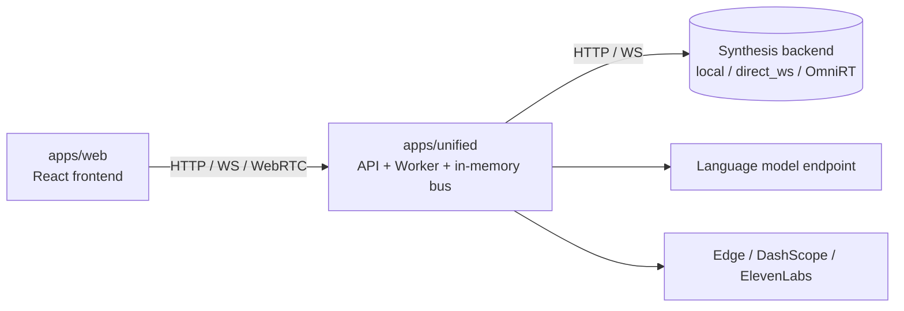
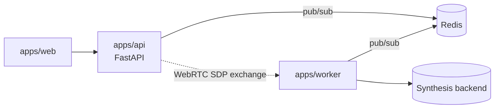

# Deployment

OpenTalking supports three deployment topologies. They are presented in order of
increasing operational complexity.

1. **Single-process (unified)** — a single Python process with an in-memory event bus, suitable for development and demonstrations.
2. **API and Worker split** — the standard production layout, with Redis as the event bus and horizontally scalable Worker processes.
3. **Docker Compose** — a packaged stack with CPU and GPU variants.

## Single-process (unified)

All components run in a single process, including the HTTP and WebSocket entry point,
session state, pipeline workers, and an in-memory event bus. Redis is not required.

```bash title="terminal"
opentalking-unified
# Equivalent invocation with explicit options:
python -m apps.unified --host 0.0.0.0 --port 8000
```

This topology is appropriate when:

- Development work is performed on a single machine.
- The deployment workload fits within one process.
- Operational simplicity is preferred over scalability.



## API and Worker split

The production deployment topology. The API process serves HTTP and WebSocket traffic,
the Worker process drives the synthesis pipeline, and Redis transports events between
them.

```bash title="terminal: API"
uvicorn apps.api.main:app --host 0.0.0.0 --port 8000
```

```bash title="terminal: Worker"
python -m apps.worker.main --host 0.0.0.0 --port 9001
```

```bash title="terminal: Redis"
redis-server --port 6379
```

Required environment variables (see also [Configuration §3](configuration.md#3-production-deployment)):

```env
OPENTALKING_REDIS_URL=redis://localhost:6379/0
OPENTALKING_WORKER_URL=http://127.0.0.1:9001
```



This topology is appropriate when:

- Multiple Worker processes share a single API instance.
- Synthesis workloads must scale independently from the API.
- Component isolation is required; a Worker failure does not affect API availability.

## Docker Compose

The repository ships two Compose files:

=== "CPU"

    ```bash title="terminal"
    docker compose up -d
    ```

    Services started: `redis`, `opentalking-api`, `opentalking-worker`, `opentalking-web`.
    Only the `mock` synthesis backend is functional without a GPU. Suitable for continuous
    integration and frontend development.

=== "GPU"

    ```bash title="terminal"
    docker compose -f docker-compose.gpu.yml up -d
    ```

    Adds OmniRT for models configured with `backend: omnirt` and configures the
    `nvidia` container runtime on the Worker container. The host must have the
    NVIDIA Container Toolkit installed.

Log files are written to `~/logs/` and process identifier files to `~/run/` only when
the `scripts/quickstart/*` helpers are used; Docker deployments use their respective
logging drivers.

## Ascend 910B

A dedicated script encapsulates the NPU deployment steps:

```bash title="terminal"
bash scripts/deploy_ascend_910b.sh
```

Prerequisites:

- CANN 8.0 or later installed at `/usr/local/Ascend/ascend-toolkit/set_env.sh`.
- The OmniRT repository checked out alongside the OpenTalking repository.
- Model checkpoints present under `$DIGITAL_HUMAN_HOME/models/`.

For exact weight downloads and model-specific startup commands, see
[Model Deployment](model-deployment.md).

Verify the deployment:

```bash title="terminal"
curl -fsS http://127.0.0.1:9000/v1/audio2video/models
# {"models":["wav2lip","flashtalk"]}
```

## Production checklist {#production-checklist}

The following items should be addressed prior to a production launch:

- Configure `OPENTALKING_CORS_ORIGINS` with the production frontend origin.
- Terminate TLS at a reverse proxy (nginx, Caddy, or equivalent). Forward `/`, `/health`, and `/sessions/{id}/events`. Disable response buffering on the SSE endpoint.
- Provision a TURN server (such as `coturn`) for clients behind symmetric NAT.
- Mount `OPENTALKING_AVATARS_DIR` and `OPENTALKING_VOICES_DIR` on persistent storage.
- Enable Redis persistence (`appendonly yes`); session state and voice metadata are stored in Redis.
- Configure structured logging by setting `OPENTALKING_LOG_LEVEL=INFO` or forwarding JSON logs to a log aggregation system.
- Configure health probes: `/healthz` for liveness; `/health` combined with `/queue/status` for readiness.
- Set `OPENTALKING_PUBLIC_BASE_URL` when CosyVoice voice cloning is enabled; DashScope must be able to retrieve voice samples from the OpenTalking server.

## Process management

The repository provides shell helpers but does not ship systemd unit files:

| Script | Purpose |
|--------|---------|
| `scripts/quickstart/start_all.sh` | Starts the unified server and the frontend for development. |
| `scripts/quickstart/start_omnirt_wav2lip.sh` | Starts OmniRT serving wav2lip. |
| `scripts/quickstart/start_omnirt_flashtalk.sh` | Starts OmniRT serving flashtalk. |
| `scripts/quickstart/status.sh` | Reports the state of known processes. |
| `scripts/quickstart/stop_all.sh` | Stops processes started by the quickstart helpers. |

For production deployments, the API and Worker commands should be wrapped in the
process manager appropriate to the environment, such as systemd, supervisor, or a
Kubernetes Deployment.
