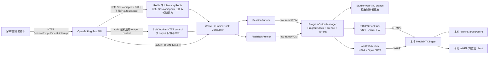

# OpenTalking 单仓 RTMPS + WHIP 推流能力执行文档

> 制定日期：2026-08-12<br>
> 文档状态：开发前冻结候选（纳入目标分支并记录 commit 后，才作为不可变执行基线）<br>
> 目标仓库：`/home/lyf/opentalking`<br>
> 面向对象：负责实现、评审和验收本功能的 Coding Agent 与工程师

本文是本次开发的唯一执行范围说明。它把已经确认的产品边界、代码改造顺序、协议契约、本地接收测试和验收门槛写成可以逐项执行的任务。除非在本文的“变更控制”一节记录新的决定，否则 Coding Agent 不应自行扩大范围。当前文件可能仍处于未提交状态；开始 P0 前必须把它加入目标开发分支、记录文件 hash/commit，并在后续 PR 中引用该版本。

## 0. 一句话结论

本次只在 OpenTalking 单仓中，把**正在运行的实时数字人 Session** 输出到两类外部接收端：

```text
OpenTalking Session
       │ 统一的 Program 原始音视频
       ├── RTMPS  ──> 直播平台或本地 RTMPS ingest
       └── WHIP   ──> WebRTC ingest（本地用 WHEP/浏览器观看）
```

Enterprise、PostgreSQL、多租户、公共 API key、Webhook、SRT、HLS、LL-HLS、生产 WHEP 服务端、视频生成 Job 转直播，均不属于本次实现。

RTMPS 和 WHIP 是**媒体输出协议**；`start`、`speak`、`interrupt`、`stop` 等控制仍通过 OpenTalking 自己的 HTTP API 和现有 Session/Worker 机制完成，不通过 RTMP 传递控制消息。本文中的 WHIP/WHEP 仅指 OpenTalking 作为 WHIP 发布客户端、MediaMTX 作为本地测试 ingest/reader；不把 OpenTalking 变成 WHEP 服务端。

## 1. 当前状态与事实基线

### 1.1 已经存在的能力

当前仓库已经有完整的实时数字人基础链路：

| 能力 | 当前实现 | 本次处理方式 |
| --- | --- | --- |
| Session 创建 | `apps/api/routes/sessions.py`、`apps/api/services/session_service.py` | 保留并扩展输出控制 |
| 文本口播 | `POST /sessions/{session_id}/speak` | 保留 `replace` 语义，补充命令关联 |
| 打断 | `POST /sessions/{session_id}/interrupt` | 保留并让所有输出分支同步结束 |
| 浏览器实时播放 | `opentalking/providers/rtc/aiortc/adapter.py` | 保留为独立 WebRTC 播放分支 |
| 数字人渲染 | `SessionRunner` 与 `FlashTalkRunner` | 两条路径都接入统一 ProgramSink |
| 音频 | `AudioChunk`，通常为 16 kHz、单声道、int16 PCM | 统一重采样到节目音频时钟 |
| 视频 | `VideoFrameData`，BGR/RGB `uint8` ndarray | 统一尺寸、FPS 和节目时间戳 |
| 任务转发 | Redis List 或 unified 模式的 `InMemoryRedis` | 复用，不把原始帧放入 Redis |
| 事件通知 | Redis Pub/Sub + SSE | 增加输出状态事件；不宣称可重放 |
| 离线视频生成 | `apps/api/routes/video_creation.py` 等 | 不改、不接入 RTMPS/WHIP |

当前 WebRTC 是浏览器发送 offer、OpenTalking 返回 answer 的 **answerer/playback** 模式。它不能直接拿来做 WHIP，因为 WHIP 发布端必须由 OpenTalking 创建 offer 并向外部 ingest POST SDP。

### 1.2 已知缺口

实现前必须承认以下事实，不能在代码或文档中假装它们已经存在：

1. 当前 `SessionRunner` 和 `FlashTalkRunner` 都主要向 `self.webrtc` 写帧，没有 transport-neutral 的节目输出层。
2. 两类 runner 都必须改；只改 `opentalking/pipeline/session/runner.py` 会漏掉 QuickTalk/OmniRT/FlashTalk 等实际路径使用的 `FlashTalkRunner`。
3. 当前 idle 循环主要发送视频，不能保证外部输出需要的连续静音音频。
4. 当前 WebRTC track 是单队列消费者；同一个队列不能同时给 Studio 浏览器和 WHIP 消费，否则两个 `recv()` 会竞争并分走帧。
5. 当前每轮 speech 可能把 source timestamp 清零；外部输出必须使用独立、连续、不回退的 ProgramClock。
6. 当前 `speak` 是“先 interrupt，再写任务”，没有跨重试的 `command_id`/幂等收据。
7. 当前没有 RTMP/RTMPS、WHIP/WHEP、MediaMTX 或 SRS 测试服务。
8. `docker/Dockerfile.api`、`docker/Dockerfile.worker` 和 `docker/Dockerfile.flashtalk` 使用 `COPY src ./src`，而仓库实际为 flat layout，`src/` 不存在；容器集成前必须修复并验证相关 Docker 构建。根 `docker-compose.yml` 还必须显式给 API 设置 `OPENTALKING_WORKER_URL=http://worker:9001`。
9. 当前不存在 Enterprise 控制面。本次不要把 Enterprise 文档中的 `/integrations/v1`、PostgreSQL、租户或 webhook 代码搬进来。

### 1.3 当前已验证的基线

在开始编码前保存以下基线结果。基线失败不自动归因于本功能；最终门禁比较“新增失败”而不是要求清除所有历史欠账。

```bash
cd /home/lyf/opentalking
.venv/bin/pytest tests/unit/test_aiortc_adapter.py \
  tests/unit/test_session_runner_media_events.py -q
.venv/bin/ruff check opentalking apps tests
git status --short --branch
```

已知相关 RTC/media 单元测试基线为 5 passed；实际运行时以当前机器输出为准，并把完整输出保存到开发记录，不把输出文件提交到仓库。

## 2. 范围冻结

### 2.1 本次必须交付

- OpenTalking 内部统一的 Program/ProgramClock/ProgramSink/fan-out 层。
- 对 `SessionRunner` 和 `FlashTalkRunner` 的统一接入。
- Studio 浏览器 WebRTC 与外部输出互不抢帧，任一消费者退出不影响其他消费者。
- Session 级 beta 输出 API（受控部署使用，默认 fail-closed 鉴权）。
- RTMPS publisher：连续 H.264 + AAC FLV 媒体、严格 TLS、重连和状态。
- WHIP publisher：OpenTalking 作为 WHIP client/offerer，发送 H.264 + Opus RTP/DTLS/SRTP 媒体。
- 本地固定版本的 MediaMTX v1.20.0（镜像 digest 在 P0 记录；若版本变更，必须重新验证配置和协议），作为可复现 ingest 测试环境。
- 本地 RTMPS 接收/检查客户端和 WHIP 对应的 WHEP/浏览器观看客户端。
- mock 模型 + mock TTS 的无 GPU 自动化路径。
- idle → speech → interrupt → idle 的连续时间线验证。
- 错误凭证、错证书、主机名不匹配、断线重连、慢/死接收端等负测试。
- README/配置/运行文档和本执行文档中描述的 API 示例。

### 2.2 明确不做

以下事项不得作为本次“顺便实现”：

- 不修改 `/home/lyf/opentalking-enterprise`，不新增 Enterprise 依赖。
- 不实现公共 SaaS 控制面、租户隔离、API key scope、PostgreSQL 权威状态或 Webhook。
- 不实现生产 SRT、HLS、LL-HLS、WHEP server、SFU、多观众分发；本地测试允许使用 MediaMTX 已有的 WHEP/playback 能力作为接收端。
- 不把离线视频生成 MP4 自动推到直播平台；`video_creation` 继续独立运行。
- 不把 RTMP/RTMPS 控制命令当作客户端消息通道。
- 不支持用户透传任意 FFmpeg/GStreamer 参数、任意 shell 命令或任意 SDP。
- 不承诺跨进程重启后自动恢复带 secret 的外部输出；本次采用 fail-closed，重启后必须重新提交 secret 并创建 output（不能对丢失 secret 的旧 output 宣称可 reconnect）。
- 不把 WHIP 和现有 Studio WebRTC 复用同一个 `RTCPeerConnection` 或同一个媒体队列。
- 不为了“编码一次”牺牲协议正确性：RTMPS 的 AAC 不能直接当作 WHIP 的 Opus；WHIP 至少有独立音频编码链。

### 2.3 用户可见的第一版定义

第一版可用（MVP）必须能在一台本机上完成：

1. 启动 OpenTalking unified 或 API+worker 模式，并显式设置 streaming control token（测试 profile 才允许专用绕过开关）。
2. 用 `model=mock`、`tts_provider=mock` 创建 Session。
3. 调用 `/sessions/{id}/start`，等待 Session ready；创建一个 RTMPS output 和一个 WHIP output。`auto_connect=true` 只表示“ready 后自动连接”，不跳过 ready 门槛。
4. 两个 output 都进入 `connection_state=connected`、`health=healthy`。
5. 发送一条 `speak`，本地 RTMPS 接收客户端和 WHIP/WHEP 客户端同时看见并听见。
6. 发送 `interrupt`，旧口播停止，节目时间线不断轨。
7. 删除/断开任一 output，另一个 output 和 Studio WebRTC（若存在）继续工作。
8. 重复同一 `command_id` 不会让数字人重复口播。
9. 对某一路 publisher 的 ingest listener/session/网络做故障注入后，该路能按策略重连；超过预算时进入 `connection_state=failed`、`health=failed`，且不阻塞渲染或另一协议。仅关闭下游观看客户端不算 publisher 断线测试。

## 3. 目标架构

### 3.1 组件关系



### 3.2 强制职责边界

| 层 | 负责 | 不负责 |
| --- | --- | --- |
| API/控制层 | Session、output 配置、命令校验、鉴权、状态查询 | 编码、阻塞等待第三方 ingest |
| Runner | 模型准备、TTS、口型视频、idle/speech 原始帧 | 了解 RTMPS URL、WHIP SDP 或第三方重连细节 |
| Program 层 | 连续节目时钟、CFR、静音补齐、帧 fan-out、背压隔离 | 选择第三方 endpoint、保存 stream key |
| RTMPS branch | H.264/AAC 编码、FLV、TLS、publish/reconnect | 直接调用模型或改 Session 状态机 |
| WHIP branch | H.264/Opus 编码、RTP/ICE/DTLS/SRTP、WHIP HTTP 生命周期 | 复用 Studio WebRTC 信令 |
| 本地 harness | ingest、拉流/观看、ffprobe、故障注入 | 代替生产 publisher 或隐藏协议错误 |

### 3.3 两条 runner 必须统一

任务工厂会根据 backend 把会话构造成不同 runner。实施时必须检查并覆盖：

- `opentalking/pipeline/session/runner.py` 的 `SessionRunner`。
- `opentalking/pipeline/speak/synthesis_runner.py` 的 `FlashTalkRunner`（`FlashTalkSessionRunner` 别名也要覆盖）。
- `opentalking/runtime/task_consumer.py` 的 runner 创建、`speak`、`interrupt`、`close` 分发。
- `opentalking/runtime/server.py`（split worker 持有 runner）。
- `apps/unified/main.py`（unified 模式持有 runner）。

`OPENTALKING_STREAMING_ENABLED=true` 时，两类 runner 均只调用如下抽象，不直接访问 output 实现；flag=false 时保留当前直接 WebRTC sink，作为可验证的兼容/回滚路径：

```python
await program.offer_video(frame, source="idle" | "speech", utterance_id=...)
await program.offer_audio(pcm, sample_rate, source="silence" | "speech", utterance_id=...)
await program.mark_utterance_end(utterance_id)
```

## 4. 控制 API 与命令语义

本节定义的是 OpenTalking 单仓 beta API，不是 Enterprise `/integrations/v1` API。

### 4.1 API 前缀与鉴权边界

现有 Session API 继续使用当前前缀：

```text
POST   /sessions
GET    /sessions/{session_id}
POST   /sessions/{session_id}/start
POST   /sessions/{session_id}/speak
POST   /sessions/{session_id}/interrupt
DELETE /sessions/{session_id}
POST   /sessions/{session_id}/webrtc/offer
GET    /sessions/{session_id}/events
```

新增 output API：

```text
POST   /sessions/{session_id}/outputs
GET    /sessions/{session_id}/outputs
GET    /sessions/{session_id}/outputs/{output_id}
POST   /sessions/{session_id}/outputs/{output_id}/connect
POST   /sessions/{session_id}/outputs/{output_id}/disconnect
POST   /sessions/{session_id}/outputs/{output_id}/reconnect
DELETE /sessions/{session_id}/outputs/{output_id}
```

这是 beta 接口，但“私网”不是安全边界。第一版采用 fail-closed 鉴权：

- `OPENTALKING_STREAMING_ENABLED=true` 时，`OPENTALKING_STREAMING_CONTROL_TOKEN` 必须为非空高熵值，否则进程启动失败；只有专用 streaming test profile 才可通过单独的、默认不存在于生产配置的 bypass 开关绕过。
- 所有 output API（无论是否带 `Idempotency-Key`）都必须携带 `Authorization: Bearer ...`；split worker 内部 output control route 也必须使用独立内部 token 或等价的双向身份校验，不能裸露在 9001 端口。
- `speak`/`interrupt` 是否纳入此 token 由现有 API 鉴权策略决定；不能因请求没有幂等头而跳过 output API 鉴权。
- 使用常量时间比较；任何 secret 不写日志、SSE、异常 message 或状态响应。
- 不虚构多租户；进程级 token 只用于受控部署。
- `OPENTALKING_STREAMING_ALLOW_LOCAL_TARGETS=1` 仅用于本地测试，生产默认关闭。

后续若要公开给第三方，应另立 Enterprise/API-key 设计，不在此处临时扩展。

### 4.2 创建 output 请求

```http
POST /sessions/sess_xxx/outputs
Authorization: Bearer <control-token>
Content-Type: application/json
Idempotency-Key: output-unique-001
```

RTMPS 示例：

```json
{
  "type": "rtmps",
  "name": "本地 RTMPS 接收端",
  "auto_connect": true,
  "transport": {
  "endpoint": "rtmps://localhost:1936/live",
    "stream_key": "rtmps-test",
    "username": "publisher",
    "password": "<runtime-generated-test-secret>",
    "tls_verify": true
  },
  "profile": {
    "width": 1280,
    "height": 720,
    "fps": 25,
    "video_bitrate_kbps": 2500,
    "gop_seconds": 2
  }
}
```

WHIP 示例：

```json
{
  "type": "whip",
  "name": "本地 WHIP 接收端",
  "auto_connect": true,
  "transport": {
    "endpoint": "https://localhost:8889/whip-test/whip",
    "bearer_token": "<runtime-generated-test-token>",
    "tls_verify": true
  },
  "profile": {
    "width": 1280,
    "height": 720,
    "fps": 25,
    "video_bitrate_kbps": 2500,
    "gop_seconds": 2
  }
}
```

说明：自签名证书不等于关闭验证。本地 harness 运行时生成带 `DNS:localhost`（以及实际需要的 IP SAN）的短期证书，通过管理员配置的 `OPENTALKING_STREAMING_*_CA_FILE` 把测试 CA 注入 RTMPS/WHIP client，并始终执行证书链和 hostname 验证。output 请求不能提交任意本机 CA 文件路径。生产 WHIP endpoint 必须是 HTTPS。`tls_verify=false` 和公共 RTMP（非 TLS）只允许专用负测代码显式使用，不能出现在正常测试或生产配置中。

RTMPS 地址采用结构化字段，不能让调用方传“拼好的秘密 URL”。首版规范如下：

- `endpoint` 只包含 `rtmps://host[:port]/app`；拒绝 userinfo、query、fragment、空 path、非规范 IP 表达和 percent-encoded 分隔符。
- `stream_key` 是单个 RTMP publish name/path segment，UTF-8 编码后 1–128 bytes；首版仅接受 `[A-Za-z0-9._-]+`，拒绝 `/`、`\\`、`?`、`#`、`%`、控制字符和 `..`，并始终按 secret 脱敏。需要 signed query 的平台必须在 P0 用真实样例增加结构化字段和测试，不能让调用方塞一段任意 URL。
- `username/password` 是可选 publish 凭证。调用方不能把它们放进 endpoint；adapter 只在目标协议明确要求时，使用库的凭据参数或内部构造的、全程脱敏的 query 传递。例如 MediaMTX v1.20.0 的 RTMP 内部认证要求 `?user=...&pass=...`，该 query 只能由 adapter 从结构化字段生成。
- 最终发布语义是 app=`/live`、stream key=`rtmps-test`；本地 MediaMTX 最终 path 为 `live/rtmps-test`。最终 URL 只存在于 publisher 内存，不能写日志、状态、异常、指标 label 或 proc args（FFmpeg fallback 的例外风险见 6.2）。

服务端必须：

1. 只接受声明过的字段，拒绝任意 codec/FFmpeg 参数透传。
2. 单独校验公开 endpoint 与 secret 字段。
3. secret 只进入持有 publisher 的 worker 内存；Redis/InMemoryRedis 只保存脱敏摘要和收据，不保存 stream key、密码或 bearer。GET 永不回显，可返回 `secret_configured: true`。
4. 对 endpoint 执行 scheme、端口、DNS、IP/CIDR allowlist 和完整 SSRF 检查；实际 socket 必须连接到已经批准并 pin 的 IP，同时保持 TLS SNI/hostname 校验，不能让下层库再次解析未固定的 hostname。
5. 保存 `output_id`、状态、配置摘要、最近错误（脱敏）和 attempt 计数。

推荐响应：

```json
{
  "output_id": "out_01J...",
  "session_id": "sess_01J...",
  "type": "rtmps",
  "connection_state": "connecting",
  "health": "unknown",
  "secret_configured": true,
  "created_at": "2026-08-12T10:00:00Z",
  "updated_at": "2026-08-12T10:00:00Z"
}
```

### 4.3 连接状态与健康度

```text
connection_state:
created -> connecting -> connected -> reconnecting -> connected
                         \-> stopping -> stopped
connecting/reconnecting -> failed

health（正交字段）:
unknown -> healthy <-> degraded -> failed
```

定义：

- `connection_state=created`：配置已接受，尚未建立外部连接。
- `connection_state=connecting|connected|reconnecting|stopping|stopped|failed`：只描述协议连接生命周期；`failed` 表示超过重试预算或确定性配置/鉴权失败。`stale` 只作为内部原因/错误码，不作为公开状态值。
- `health=unknown`：尚无足够媒体证据。
- `health=healthy`：最近窗口内有视频、音频和字节进度，时间戳符合约束。
- `health=degraded`：暂时无媒体进度、队列接近上限或正在恢复；不应阻塞其他 branch。
- `health=failed`：该连接没有可用媒体且当前不可自动恢复。

`connection_state=connected` 不能仅由“pipe 写成功”判定。RTMPS 必须完成 publish 并写出首个有效媒体包；WHIP 必须完成 SDP/ICE/DTLS。两者都要观察 outbound bytes/媒体进度后，才能另行设置 `health=healthy`。RTMPS 若底层库不能暴露服务端 publish status，只能把“写首包且连接在健康窗口内未关闭”记为 connected/unknown，不能伪造协议 ACK。

### 4.4 `start`、`speak`、`interrupt`、`stop`

本次不另造 Enterprise Command 表，而是扩展现有 Session 控制：

| 动作 | API | 语义 |
| --- | --- | --- |
| start | `POST /sessions/{id}/start` | 必须改造成真正等待/确认 runner ready；已有 output 的 `auto_connect` 在 ready 后连接。超时返回明确的 503/timeout，不把仅写 Redis 状态当作 ready |
| say | `POST /sessions/{id}/speak` | 首期固定 `mode=replace`，先取消当前口播再开始新 utterance |
| interrupt | `POST /sessions/{id}/interrupt` | 取消当前 utterance；输出节目继续 idle，不关闭 output |
| stop | `DELETE /sessions/{id}` 或 output disconnect | Session 关闭时先停止口播、停止 idle、drain 并关闭所有 output |

`speak` 请求可增加以下字段/头：

```json
{
  "text": "欢迎来到 OpenTalking",
  "mode": "replace",
  "command_id": "cmd_say_001",
  "voice": null,
  "tts_provider": "mock",
  "tts_model": null
}
```

兼容策略：旧客户端只发 `{text, voice, ...}` 时服务端生成 command id；新客户端可以显式传 `command_id` 或 `Idempotency-Key`。若两者同时存在，值必须相同，否则返回 400。同一 Session、同一 command id、相同 payload 必须返回原收据且不重复创建 speech task；同 id 不同 payload 返回 409。短期收据 TTL 至少 24 小时，存储实现必须同时支持 Redis 和 `InMemoryRedis`；原子性和 crash 语义见 10.2。

`mode=enqueue`、无限队列、跨 Session 排队不在本次范围。

### 4.5 事件字段

沿用现有 `/sessions/{id}/events` SSE，并增加字段而不破坏旧字段：

```json
{
  "event": "speech.started",
  "data": {
    "session_id": "sess_xxx",
    "utterance_id": "cmd_say_001",
    "text": "欢迎来到 OpenTalking"
  }
}
```

新增/扩展事件：

- `output.state_changed`：`output_id`、旧/新 `connection_state`、旧/新 `health`、脱敏 reason。
- `output.media_started`：首个有效媒体时间。
- `output.reconnecting`：attempt、退避秒数、脱敏 reason。
- `speech.started`、`speech.media_started`、`speech.ended`、`error`：都带 `utterance_id`（旧客户端可缺省）。

SSE 是实时通知，不是可靠事件日志；断线客户端通过 GET 状态重新同步。

## 5. Program 层详细设计

### 5.1 原始媒体契约

扩展 `opentalking/core/types/frames.py` 或新增 `opentalking/streaming/types.py`，至少定义：

```python
@dataclass(slots=True)
class ProgramVideoFrame:
    data: np.ndarray          # BGR uint8, contiguous
    width: int
    height: int
    source_timestamp_ms: float
    source: Literal["idle", "speech", "slate"]
    utterance_id: str | None
    source_sequence: int


@dataclass(slots=True)
class ProgramAudioChunk:
    data: np.ndarray          # int16 mono PCM
    sample_rate: int
    source: Literal["silence", "speech"]
    utterance_id: str | None
    source_sequence: int
```

原始媒体不经过 Redis/NATS/PostgreSQL；只在同一进程内的有界 asyncio queue、必要时同机共享内存中传递。控制状态可以写 Redis，但不能把 ndarray 或 base64 媒体帧写 Redis。

### 5.2 ProgramClock

ProgramClock 是输出节目的唯一时间基准，不能由某个 WebRTC PeerConnection 或某轮 TTS 拥有。

首版固定默认值：

- 视频：25 FPS，CFR；profile 可在安全范围内配置 15–30 FPS。
- 音频：48 kHz，20 ms tick（960 samples），mono 源转换为 stereo 输出时复制声道。
- 音频作为节目主时钟；视频按 CFR tick 对齐。
- 每个节目从第一次 output attach 开始计时；idle/speech/interrupt 不重置节目 PTS。
- output reconnect 可以从新的协议连接 timestamp 0 开始，但不能修改内部 Program sequence；从下一个 IDR 开始发送。worker 重启不是 reconnect：由于 secret 不持久化，必须重新创建 output。
- 所有 PTS/DTS 单调不下降；溢出、负值、源时间戳回退必须由 ProgramClock 修正并计数告警。

ProgramClock 每个 tick 做：

1. 读取最新可用 idle/speech 视频帧；没有新帧时重复上一帧或 slate（不停止视频）。
2. 读取 speech PCM；没有 speech 时补 20 ms 零值静音。
3. 生成一份 immutable tick，复制给各 branch 的有界队列。
4. 记录 `program_pts_ns`、`video_sequence`、`audio_samples`、source/utterance metadata。

### 5.3 idle 与 speech

- 任意 output active 时，即使没有 Studio 浏览器 offer，也必须运行 idle 节目。
- `SessionRunner` 与 `FlashTalkRunner` 当前依赖 WebRTC 状态的 idle 条件必须改为“是否存在任意 active Program consumer”。
- Studio 浏览器关闭不能自动销毁仍有 RTMPS/WHIP output 的 Session。
- speech 开始时，不清空 Program branch 的外部时间线；只切换 source，并发出旧 utterance 的 cancel/end marker。
- speech 结束或 interrupt 后，立刻回到 idle 视频 + 静音音频。
- 不允许为了清理某个 WebRTC 队列而清理其他 output 的队列。

### 5.4 Fan-out 与背压

每个 consumer 独立拥有：

- 输入 queue/ring（必须有界）。
- 编码/协议连接状态。
- `last_enqueued_pts`、`last_sent_pts`、queue depth、丢弃计数。
- reconnect budget 和 attempt id。

规则：

- 慢的 RTMPS/WHIP branch 不得阻塞模型推理、TTS、ProgramClock 或其他 branch。
- idle 视频可以丢旧帧，直到下一个 IDR；speech 音频不得静默重复，缺包时 branch 进入 degraded 并重建。
- branch 队列达到上限时，优先断开并从下一个 IDR 重连，而不是无限增长；此时 `connection_state=reconnecting`、`health=degraded`。
- Studio WebRTC、RTMPS、WHIP 三个消费者必须用不同队列；不能把同一个 aiortc `MediaStreamTrack` 添加到两个 PeerConnection。

### 5.5 编码边界

允许共享的是：

```text
raw Program ticks -> RTMPS H.264/AAC encoder + WHIP H.264/Opus encoder
```

首版不要求全协议“只编码一次”。具体约束：

- RTMPS/SRT/HLS（本次只有 RTMPS）未来可以共享 H.264 elementary stream。
- WHIP 的音频必须独立为 Opus；AAC 不能直接放进 RTP/WHIP。
- 视频 H.264 是否与 RTMPS 复用，必须以编码器参数和接收端互通测试为准；不能为了复用违反 WHIP profile。

## 6. RTMPS 实施规范

### 6.1 媒体格式

首版 RTMPS 输出固定为：

```text
Container: FLV over RTMPS
Video: H.264/AVC, constrained-baseline 或 baseline, yuv420p
       无 B-frame，CFR 25 FPS，GOP 2 秒，packetization 可被常见平台接受
Audio: AAC-LC, 48 kHz, stereo（mono 源复制到双声道）
```

用户不能通过请求修改任意 codec profile、GOP、FFmpeg filter 或命令行参数。只允许文档规定范围内的 width/height/fps/bitrate。

### 6.2 Publisher 选择

实现顺序：

1. 先实现 `opentalking/streaming/destinations/rtmps.py` 的 publisher 接口和 PyAV/libavformat spike。
2. 优先使用进程内 PyAV，避免 stream key 出现在 `/proc/<pid>/cmdline`。
3. 若经过 Phase 0 spike 证明目标环境的 PyAV 不能稳定完成 RTMPS publish，才允许使用隔离的 FFmpeg supervisor；此时文档和日志必须明确：stream key 可能出现在同机进程参数中，不能声称“绝不出现在 proc args”。
4. 无论实现选择如何，禁止 shell 拼接；FFmpeg 只能用 `create_subprocess_exec` 的 argv 数组，stderr 必须脱敏。

### 6.3 TLS、DNS 与 SSRF

- 生产默认只允许 `rtmps://`；`rtmp://` 仅在显式 test/local 开关下允许。
- TLS 必须 `tls_verify=1`，验证可信 CA 和 hostname；不能依赖 FFmpeg 默认值（默认可能为 0）。
- endpoint host、解析出的所有 A/AAAA、端口必须通过 allowlist；每次 reconnect 重新解析并重新检查。P0 必须先证明 publisher 能把实际 socket pin 到已批准 IP，同时用原始 hostname 做 TLS SNI/证书校验；若 PyAV/FFmpeg 无法提供该能力，必须在受控 resolver/proxy 或隔离网络中实现，不能只在 URL 校验后让库再次 DNS 解析。
- 校验并拒绝 userinfo、fragment、query、IPv4 整数/八进制变体、IPv6 zone ID、异常 percent encoding；禁用 `HTTP_PROXY`/`HTTPS_PROXY`/`ALL_PROXY` 等环境代理，除非显式配置且同样经过 egress 审核。WHIP 的 redirect 和最终 `Location` 每一跳都重复此策略。
- 不允许默认访问 localhost、RFC1918、link-local、metadata service、Unix socket 或 file protocol。
- 本地 harness 通过专门的 `ALLOW_LOCAL_TARGETS=1` 和固定端口放行，不把该配置写入生产示例。
- 不允许把完整 URL、stream key、第三方响应原文写入日志或错误响应。

### 6.4 连接、健康与重连

连接顺序：

1. 解析和校验 endpoint。
2. 建立 TCP/TLS，验证证书和 hostname。
3. 完成 RTMP handshake/connect/createStream/publish。
4. 写 AVC/AAC sequence header。
5. 等待下一个 IDR，发送媒体。
6. 若底层暴露 RTMP publish status，则先确认成功；否则明确记录 capability limitation。首个有效视频和音频包写出且经过健康观察窗口后，才标记 `health=healthy`。

重连规则：

- 每个 reconnect 都有新的 attempt id。
- 新连接使用新的协议 timestamp 起点；内部 Program sequence 继续递增。
- 等待 IDR 后再写，最长等待 `GOP + 500 ms`；超时记录 degraded。
- 证书错误、hostname 不匹配、非法 endpoint 属于确定性失败，不重试。RTMP 没有 HTTP 401/403/5xx 语义：只有收到可识别的 RTMP command/status（例如 `NetStream.Publish.BadName` 或明确 connect rejection）才分类为永久认证失败；普通 server disconnect 无法分类时按有限预算重试并记录协议阶段。
- network error、服务端拒绝、短暂 write stall 可指数退避，最大间隔和总预算由配置限制。
- 一个 RTMPS branch 失败不影响 WHIP、Studio WebRTC 或模型渲染。

## 7. WHIP 实施规范

### 7.1 角色澄清

本次 OpenTalking 是 WHIP **publisher/client/offerer**：

```text
OpenTalking -- HTTPS WHIP POST + WebRTC media --> 第三方 WHIP ingest
```

不要求先建设 SFU。SFU/WHEP server 只有在我们自己要服务多个观看者时才需要；本地测试使用 MediaMTX 的 WHIP ingest，再由 WHEP 或浏览器客户端观看。

现有 Studio WebRTC 是另一条 answerer/playback 连接，不能复用。

### 7.2 WHIP v1 行为

首版采用完整 ICE、暂不 trickle ICE，以降低信令状态复杂度；接口保留后续 PATCH 扩展点。

必须实现：

1. 创建独立 `RTCPeerConnection`，配置 max-bundle 和经过审核的 ICE servers；P0 先证明 aiortc 版本能实施候选过滤/relay-only 或通过隔离网络防止内部拓扑泄露，不能只删 SDP 文本。
2. 添加一个 video track 和一个 audio track，方向为 `sendonly`。
3. 使用单一 MediaStream；每种 media 最多一条 track。
4. `createOffer()` → `setLocalDescription(offer)`；等待 `iceGatheringState=complete`，再使用 `pc.localDescription.sdp` POST，不在 setLocalDescription 后另行修改一份 SDP。
5. POST `Content-Type: application/sdp` 到 WHIP endpoint，并按批准 origin 发送 Bearer。
6. 只接受 `201 Created`；强制校验响应 `Content-Type: application/sdp`、非空合法 SDP answer、Location 为允许的绝对/安全相对 URL、answer 的 m-line 数量与顺序与 offer 相同、方向为 `recvonly`/无部分拒绝。状态校验或 `setRemoteDescription` 失败时 best-effort DELETE 已返回的 Location，然后报错，不得标 healthy。
7. 观察 ICE/connection state 和 outbound bytes；确认有媒体进度后才设置 `health=healthy`。
8. stop/disconnect 时对已批准的 resource Location 发送带 Bearer 的 DELETE；DELETE 失败要记录脱敏结果并关闭本地 PeerConnection。
9. 断线重连使用全新的 POST/PeerConnection；不重复复用旧 resource。

可选的 trickle ICE（后续小阶段）：

- PATCH `Content-Type: application/trickle-ice-sdpfrag`。
- 使用 ETag/If-Match；缺失返回 428，版本冲突返回 412。
- 每个 PATCH 有序、可重试且不泄漏 bearer token。

### 7.3 HTTP redirect 与认证

RFC 9725 允许受控重定向；“一律禁止 redirect”不是本实现的正确契约。首版规则：

- HTTP client 关闭自动重定向和环境代理（例如 `follow_redirects=false`、`trust_env=false`），由本模块只接受有限次数的 307/308，并显式保留 POST method 和 SDP body。
- 每一跳重新进行 HTTPS、DNS、固定 IP、端口和 host allowlist 校验；最终 resource `Location` 也单独记录并校验 origin。
- 同 origin 的重定向 POST、以及同 origin/显式批准 origin 的 resource DELETE 必须携带 Bearer。跨 origin 默认拒绝；只有显式批准该 origin 且重新完成 egress 安全评审时才允许携带 Bearer，不能“继续请求但不带凭据”而把失败伪装成兼容。
- 相对 `Location` 按原始 endpoint 安全解析并再次校验。
- WHIP 401/403、非法 SDP、Location 校验失败立即停止自动重试；网络错误和 5xx 按 Retry-After/退避策略处理。
- 禁止把 SDP、Authorization、Location 或第三方 response 原文写日志。

### 7.4 WHIP 编码与 SDP

首版目标：

```text
Video: H.264 constrained-baseline/baseline,
       packetization-mode=1，显式 payload/profile 配置
Audio: Opus, 48 kHz，mono 或 stereo（默认 stereo）
Transport: RTP/RTCP + ICE + DTLS/SRTP，rtcp-mux，BUNDLE
```

aiortc 当前默认 offer 可能优先 VP8，且不自动生成所有严格 WHIP 接收端期待的 SDP 属性。因此必须：

- 显式设置 codec preference，不能依赖默认顺序；优先通过 transceiver API 完成，不能只改字符串。
- 对发出的 SDP 做经过测试的最小 normalizer，或维护明确的 aiortc patch；任何线级修改都必须证明与 JSEP/aiortc 内部状态一致，不能修改后再调用 `setLocalDescription` 造成状态不一致。
- 检查 `sendonly`、single MediaStream、max-bundle、full ICE、`a=rtcp-mux-only`、必要 m-line 的 `bundle-only` 和 H.264 fmtp。
- 过滤不希望暴露的 host candidates；如果当前 aiortc 无 candidate-policy/filter API，必须采用 relay-only/受控 ICE proxy/网络隔离并在 P0 记录，不能声称删除 SDP candidate 就完成过滤。
- P4 coding gate 只要求固定版本 MediaMTX 互通；第二个固定版本、可复现且有启动/凭据说明的 WHIP endpoint 才能作为 release certification，否则不得写成强制门槛。

## 8. 代码改造工作包

以下工作包按依赖顺序执行。每个工作包都必须包含实现、单元测试、必要的 API/配置测试和一条可复现的验收命令。

### P0：分支、基线与构建前置

**目标**：在不改变现有运行行为的前提下，冻结工作分支和构建基线。

**任务**：

- 从 OpenTalking 最新主仓建立独立分支，例如 `feat/standalone-rtmps-whip`；不在 `feat/tipping-qr-code` 上混做推流。
- 保存 pytest/ruff/mypy/前端 build 基线；记录已有失败。
- 修复并测试 `docker/Dockerfile.api`、`docker/Dockerfile.worker`、`docker/Dockerfile.flashtalk` 的 flat-layout COPY（只复制各镜像实际需要的 `opentalking/`、`apps/`、`configs/`、`examples/`，不要复制不存在的 `src/`）；在根 `docker-compose.yml` 为 API 显式设置 `OPENTALKING_WORKER_URL=http://worker:9001`。
- 新增 `OPENTALKING_STREAMING_ENABLED`，默认 false；关闭时现有 WebRTC、视频生成和首页行为完全不变。
- 评估 PyAV RTMPS、aiortc H.264/Opus、MediaMTX v1.20.0/image digest 和本机 FFmpeg 能力，产出 spike 记录。spike 必须回答：RTMPS/WHIP DNS pinning + TLS SNI 能否实现、aiortc candidate policy 如何实施、最终使用哪个本地镜像 digest。
- 冻结并提交本文，记录 commit/hash；冻结前不得进入 P1。

**交付物**：

- 分支和基线记录（不提交模型、secret 或大文件）。
- Docker build 可通过的修复。
- `opentalking/core/config.py`、`configs/default.yaml`、`.env.example`、`scripts/quickstart/env.example` 的 feature flag 骨架。
- `docs/zh/roadmap/` 下本文件的实现状态勾选。

**验收**：

```bash
docker compose -f docker-compose.yml config --quiet
docker build -f docker/Dockerfile.api .
docker build -f docker/Dockerfile.worker .
docker build -f docker/Dockerfile.flashtalk .
.venv/bin/pytest tests/unit/test_aiortc_adapter.py -q
```

### P1：Program、Clock 与 fan-out

**目标**：让任意 runner 在没有浏览器的情况下也能产生连续 idle/speech 节目，并让多个输出互不抢帧。

**建议新增文件**：

```text
opentalking/streaming/__init__.py
opentalking/streaming/types.py
opentalking/streaming/clock.py
opentalking/streaming/program.py
opentalking/streaming/manager.py
opentalking/streaming/tracks.py
opentalking/streaming/state.py
opentalking/streaming/security.py
```

**需要修改文件**：

```text
opentalking/core/types/frames.py
opentalking/pipeline/session/runner.py
opentalking/pipeline/speak/synthesis_runner.py
opentalking/runtime/task_consumer.py
opentalking/runtime/server.py
apps/unified/main.py
opentalking/providers/rtc/aiortc/adapter.py
```

**实施步骤**：

1. 定义 Program frame/audio metadata 和 source sequence。
2. 实现 ProgramClock：连续 PTS、20 ms silence、CFR、source timestamp 回退修正。
3. 实现 `ProgramOutputManager`：attach/detach、active consumer 引用计数、bounded branch queue、state snapshot。
4. 把 `SessionRunner._video_sink`、`_audio_sink`、`idle_tick` 改为先写 Program，再由 WebRTC branch 消费。
5. 把 `FlashTalkRunner._video_put_safe`、`_audio_put_safe`、idle 注入和 `_queue_av_chunk` 接到同一 Program；不能遗留只看 `_webrtc_started` 的外部输出阻断条件。
6. 让 Studio WebRTC branch 适配新的独立 queue；保持旧 offer API 和浏览器体验。
7. 让 runner close 先 detach outputs、drain、再关闭 WebRTC/模型；浏览器断开不再关闭仍被外部 output 引用的 Session。
8. P1 只定义 manager 的进程内命令接口和测试 fake；split/unified 共享 HTTP/control handler 在 P2 实现，避免 P1 依赖尚未建立的 API 模块。
9. feature flag 必须是真正的旁路：`STREAMING_ENABLED=false` 时不创建 ProgramOutputManager，仍走当前直接 WebRTC sink；切换 flag 需要重启进程。只有 flag=true 时才启用 Program 路径，因此紧急回滚可以恢复旧链路。

**交付物**：

- ProgramClock 和 fan-out 单元测试。
- 两类 runner 的 idle/speech/interrupt/close 测试。
- 无浏览器时 Program 仍产生 idle video + silence audio 的测试。
- 慢 branch、满队列、branch 退出不影响其他 branch 的测试。

**验收**：

```bash
.venv/bin/pytest \
  tests/unit/test_program_clock.py \
  tests/unit/test_program_output_manager.py \
  tests/unit/test_runner_program_fanout.py \
  tests/unit/test_session_runner_media_events.py -q
```

门槛：连续 10 分钟 synthetic idle 不断 tick；speech/interrupt 前后 PTS 单调；Studio WebRTC、测试 sink、第三个慢 sink 同时运行时互不丢队列所有权。

### P2：Session output API 与短期状态

**目标**：不引入 Enterprise 的前提下，让客户端能够创建、查询、连接和删除 output。

**建议新增文件**：

```text
apps/api/schemas/streaming.py
apps/api/routes/streaming.py
apps/api/services/streaming_service.py
opentalking/runtime/streaming_control.py
```

**需要修改文件**：

```text
apps/api/main.py
apps/api/routes/sessions.py
apps/api/services/session_service.py
opentalking/core/redis_keys.py
opentalking/core/in_memory_redis.py   # 若状态抽象需要扩展
opentalking/runtime/server.py
apps/unified/main.py
apps/api/services/worker_service.py
opentalking/runtime/bus.py
opentalking/core/types/events.py  # 若新增结构化 payload
opentalking/events/schemas.py
```

**实施步骤**：

1. 用 Pydantic discriminated union 校验 `rtmps`/`whip` transport。
2. 创建 output handle 和脱敏状态；split 模式下 API 只在当前 HTTPS/internal-mTLS 请求生命周期内短暂接触 secret，随后经已鉴权的 worker HTTP route 传给 publisher 内存对象，绝不写 Redis List、快照、日志或幂等收据；unified 模式直接在同一进程内移交。
3. 实现 10.2 的原子 idempotency reservation 和 worker 侧去重，不得只做“先查后写”；receipt 只保存 payload hash/状态/result 摘要，不能保存原始 secret。
4. split 模式由 API 通过已鉴权的 worker HTTP route 转发；unified 模式直接调用本进程 handler；二者使用 `opentalking/runtime/streaming_control.py` 的同一 handler 和状态模型。output create 的 secret-bearing command 不走 Redis List；不含 secret 的后续状态命令可按同一 handler 调度。
5. 新增 connect/disconnect/reconnect/delete 生命周期；`/start` 改为确认 runner ready，并触发等待中的 `auto_connect`。
6. 将 `connection_state`、`health`、attempt、last_error（脱敏）、bytes/PTS 指标映射到 GET，并通过 `opentalking/runtime/bus.py::publish_event` 发布到现有 `events_channel(session_id)`。
7. HTTP 状态冻结为：create 成功接收返回 `201 Created`（body 可能为 created/connecting）；connect/disconnect/reconnect 已排队返回 `202 Accepted`；GET 返回 200；delete 完成返回 204，异步停止则返回 202。不得写模糊的“202/201”。请求不等待第三方 ingest 建连。
8. 给每个 worker 生成 `worker_boot_id`/owner epoch；快照带 TTL、owner 和 updated_at。启动/查询时发现旧 owner 的 `connecting|connected|reconnecting`，对外统一改成 `connection_state=failed`、`health=failed`、`last_error.code=stale_worker_state`，且 `secret_configured=false`，要求客户端重新创建。

**交付物**：

- OpenAPI schema 和请求示例。
- API 路由单元测试（鉴权、字段拒绝、幂等、不存在 Session、split/unified）。
- 状态转换和错误码表。

**验收**：

```bash
.venv/bin/pytest apps/api/tests/test_session_outputs.py -q
```

### P3：RTMPS publisher

**目标**：把 Program 输出可靠地推到 RTMPS ingest。

**建议新增文件**：

```text
opentalking/streaming/codecs.py
opentalking/streaming/destinations/rtmps.py
opentalking/streaming/destinations/base.py
tests/unit/test_rtmps_destination.py
```

**实施步骤**：

1. 实现 endpoint parser、安全校验和 secret 分离。
2. 实现 H.264/AAC encoder，固定 profile、GOP、sample rate、CFR。
3. 实现 FLV mux + RTMPS publish；优先 PyAV，FFmpeg 只作为经过安全评审的 fallback。
4. 实现首包健康判定、write stall、attempt、退避、IDR 重连。
5. 将 branch 指标和脱敏错误接入 output manager/SSE。
6. 用 synthetic Program 而非 GPU 模型写 RTMPS 单元/集成测试。

**交付物**：

- 结构化的 `rtmps://host/app` + `stream_key` + 可选 publish username/password 按 4.2 组合并工作。
- 错 CA、hostname mismatch、不可达 host 是确定性错误；只有收到明确 RTMP publish/connect rejection 时，坏凭据才分类为永久失败，否则按有限重试预算处理。
- 本地 RTMPS ingest 配置和接收脚本。

**验收**：

```bash
.venv/bin/pytest tests/unit/test_rtmps_destination.py -q
.venv/bin/python scripts/streaming/receive_rtmps.py \
  --url rtsp://127.0.0.1:8554/live/rtmps-test \
  --output outputs/streaming/rtmps-capture.mp4 --seconds 30
ffprobe -v error -show_streams -show_packets -show_frames \
  -of json outputs/streaming/rtmps-capture.mp4 \
  > outputs/streaming/rtmps-capture.ffprobe.json
.venv/bin/python scripts/streaming/assert_media_timeline.py \
  --ffprobe-json outputs/streaming/rtmps-capture.ffprobe.json
```

必须看到 H.264 视频和 AAC 音频，且 idle→speech→idle 不断轨。

### P4：WHIP publisher

**目标**：OpenTalking 作为 WHIP offerer 向 WebRTC ingest 发布，并由本地 WHEP/浏览器客户端观看。

**建议新增文件**：

```text
opentalking/streaming/destinations/whip.py
opentalking/streaming/whip_sdp.py
opentalking/streaming/ice.py
tests/unit/test_whip_publisher.py
tests/unit/test_whip_sdp.py
```

**实施步骤**：

1. 创建独立 aiortc `RTCPeerConnection` 和独立 Program-backed tracks。
2. 配置 max-bundle、full ICE、经过 P0 证明可行的 candidate policy 和 sendonly track。
3. 显式 H.264/Opus codec preference；验证必要 SDP 属性。
4. `createOffer` → `setLocalDescription` → 等待 ICE complete → POST `pc.localDescription.sdp`。
5. 处理并严格校验 201/`application/sdp`/Location/answer、受控 307/308、Bearer、认证失败、Retry-After；answer/setRemoteDescription 失败时清理 remote resource。
6. 观察 connection state、ICE state、outbound RTP bytes 和首个有效媒体，更新健康状态。
7. stop 时 DELETE resource；断线时 fresh PeerConnection + fresh POST。
8. 为 trickle ICE 留接口，但首版不在未覆盖测试前开启。

**交付物**：

- MediaMTX WHIP ingest 可接收 H.264 + Opus。
- WHEP/浏览器客户端可观看并听到。
- 严格 SDP fixture/normalizer 测试；第二个非 MediaMTX endpoint 互通属于 release certification，只有固定服务、版本和启动方式后才设为 gate。

**验收**：

```bash
.venv/bin/pytest tests/unit/test_whip_publisher.py tests/unit/test_whip_sdp.py -q
.venv/bin/python scripts/streaming/receive_whep.py \
  --url https://localhost:8889/whip-test/whep \
  --ca-file outputs/streaming/tls/ca.crt \
  --output outputs/streaming/whip-capture.mkv --seconds 30
.venv/bin/python scripts/streaming/assert_whep_stats.py \
  --stats outputs/streaming/whip-stats.json \
  --expect-video video/H264 --expect-audio audio/opus
```

线上 codec 必须由 offer/answer SDP、aiortc inbound RTP stats 的 codec MIME/PT 和实际 packet/track 进度共同证明为 H.264 + Opus。MKV capture 只证明可解码、时长和 A/V 连续；不能把 `MediaRecorder` 重编码后的文件 codec 当作 wire codec 证据。

### P5：本地端到端 harness 与故障注入

**目标**：在没有外部平台、API key 或 GPU 的情况下，模拟接收端并自动验收整个链路。

**新增文件**：

```text
docker/docker-compose.streaming-test.yml
configs/streaming/mediamtx.yml
scripts/streaming/generate_test_pki.sh
scripts/streaming/streaming_e2e.py
scripts/streaming/receive_rtmps.py
scripts/streaming/receive_whep.py
scripts/streaming/assert_media_timeline.py
scripts/streaming/assert_whep_stats.py
tests/integration/test_rtmps_push.py
tests/integration/test_whip_push.py
tests/integration/test_streaming_e2e.py
```

**Harness 要求**：

- 固定 MediaMTX v1.20.0 和 image digest；不能使用 floating `latest`。配置启动时执行版本断言。
- 测试网络只暴露必要端口；管理 API/metrics 仅绑定 loopback 或测试网络。
- 配置 RTMPS ingest、HTTPS WHIP ingest、WHEP/playback 和本地 CA；RTMPS 使用 `live/rtmps-test`，WHIP/WHEP 使用 `whip-test`，并使用不同 listener/故障代理，使一路故障不会同时杀死另一支。
- 使用 v1.20.0 的真实 `authInternalUsers` 配置：分别建立 `publish` 与 `read`/`playback` permission，并绑定对应 path。MediaMTX v1.20.0 的 HTTP credential parser 支持 Basic `user:pass`，也把 Bearer `user:pass` 解析为内部用户名/密码；因此 harness 的 WHIP token 可用运行时生成的 `publisher:<password>`，并验证 POST/DELETE 均携带它。RTMPS 的用户名/密码按 RTMP 客户端实际支持方式传递。这里的测试凭据只用于 MediaMTX harness，不能被误写成所有第三方 WHIP/RTMPS 的统一认证契约。
- 每次运行在临时目录或 tmpfs 生成短期 CA/server key/cert，证书带 `DNS:localhost` 和实际 IP SAN；私钥权限 0600，通过只读 volume 注入 MediaMTX，CA cert 注入 RTMPS/WHIP clients，结束后清理。不得提交固定 CA 私钥或 server 私钥。
- publish/read/control 凭据同样在运行时生成，通过 0600 临时文件、Docker secret 或受控 stdin/FD 注入；不能作为 CLI argv、Compose 明文模板或测试报告内容。
- 运行前检查容器 health，运行后自动 `down -v` 清理。
- 如果目标 MediaMTX 版本的 RTMPS TLS 配置字段不同，先锁定版本并在配置测试中验证，不允许凭记忆写未验证字段。

`configs/streaming/mediamtx.yml` 必须由 harness 把运行时凭据和 PKI 路径渲染到临时文件，核心结构固定为：

```yaml
rtmp: true
rtmpEncryption: strict
rtmpsAddress: :1936
rtmpServerKey: /run/opentalking-test-pki/server.key
rtmpServerCert: /run/opentalking-test-pki/server.crt

webrtc: true
webrtcAddress: :8889
webrtcEncryption: true
webrtcServerKey: /run/opentalking-test-pki/server.key
webrtcServerCert: /run/opentalking-test-pki/server.crt
webrtcLocalUDPAddress: :8189

authInternalUsers:
  - user: publisher
    pass: <runtime-generated-publish-password>
    ips: []
    permissions:
      - action: publish
        path: ~^(live/rtmps-test|whip-test)$
  - user: viewer
    pass: <runtime-generated-read-password>
    ips: []
    permissions:
      - action: read
        path: ~^(live/rtmps-test|whip-test)$

paths:
  live/rtmps-test: {}
  whip-test: {}
```

此片段是 v1.20.0 的配置契约，不是可直接提交的明文配置。测试必须证明：RTMPS 以结构化 username/password 生成 MediaMTX 要求的认证 query；WHIP/WHEP 使用 Authorization header；错误 publish/read 凭据均被拒绝。

**本地接收客户端**：

- RTMPS 接收：从 MediaMTX 的 RTSP/HLS playback URL 用 FFmpeg 拉取，保存短 MP4/TS；用 `ffprobe -show_packets`/`-show_frames` 自动分析 codec、duration、PTS/DTS、最大间隙和 A/V drift。
- WHIP 接收：从 MediaMTX 的 `/whip-test/whep` endpoint 用 aiortc headless client 收取；用 SDP + inbound RTP stats/codec MIME/PT 证明 wire codec，并可保存 MKV 作为解码/连续性证据。另提供 Playwright/浏览器观看脚本验证真实浏览器兼容性。
- 接收端必须记录首个音频/视频包时间和最后包时间，不只检查 HTTP 200。
- 关闭 RTSP/HLS/WHEP viewer 只测试“无观众时 publisher 仍工作”，不能测试 publisher 重连。重连测试必须独立停止/重启对应 ingest listener、删除 WHIP resource/session，或用网络代理仅阻断该协议的 RTMPS TCP / WHIP HTTPS+ICE 流量；另一协议保持在独立故障域并持续收包。

**标准测试序列**：

```text
启动 harness
  -> 启动 OpenTalking mock/unified
  -> 创建 Session
  -> POST /sessions/{id}/start 并等待 runner ready
  -> 创建 RTMPS output（auto_connect）
  -> 创建 WHIP output（auto_connect）
  -> 等待两个 output connection_state=connected, health=healthy
  -> 采集 idle 10 秒
  -> speak("欢迎来到 OpenTalking")
  -> 采集 speech
  -> interrupt
  -> 采集 idle 10 秒
  -> 仅阻断 RTMPS ingest listener/network，验证 WHIP 持续收包并等待 RTMPS 自动恢复
  -> 仅删除/阻断 WHIP resource + HTTPS/ICE，验证 RTMPS 持续收包并等待 WHIP fresh POST 恢复
  -> 单独关闭两个下游 viewer，验证 publisher 健康度不被误判为断线
  -> stop/delete Session，确认所有连接释放
```

### P6：稳定性、安全和发布

**目标**：让 beta 功能可在受控环境使用，同时不破坏现有能力。

**必须完成**：

- 10 分钟 synthetic smoke；2 小时 idle/speech soak；release 候选 8 小时 RTMPS soak。
- 断网、WHIP 5xx、RTMP connect/publish rejection、慢写、错误证书、hostname mismatch、坏 token、过期 WHIP resource。
- kill/restart publisher branch；确认其他 branch 和 runner 仍可用。
- 队列上限、内存增长、线程/任务泄漏、编码器关闭、socket 关闭。
- secret 不出日志、SSE、异常、core dump 配置说明和（若 fallback FFmpeg）proc args 风险说明。
- 更新 `docs/zh/docs/api/` 或新增 streaming 使用说明；本 roadmap 仍作为内部执行细节。
- feature flag 默认关闭；disabled path 必须直接走旧 WebRTC sink，配置切换后重启即可回滚。

## 9. 配置契约

配置字段统一放在 `opentalking/core/config.py`，并同步 `configs/default.yaml`、`.env.example`、`scripts/quickstart/env.example`。建议字段如下；最终命名必须在 P0 冻结后保持一致：

```text
OPENTALKING_STREAMING_ENABLED=false
OPENTALKING_STREAMING_CONTROL_TOKEN=
OPENTALKING_STREAMING_ALLOW_LOCAL_TARGETS=false
OPENTALKING_STREAMING_ALLOWED_HOSTS=
OPENTALKING_STREAMING_ALLOWED_CIDRS=
OPENTALKING_STREAMING_MAX_OUTPUTS_PER_SESSION=4
OPENTALKING_STREAMING_QUEUE_MAX_FRAMES=128
OPENTALKING_STREAMING_QUEUE_MAX_AUDIO_MS=2000
OPENTALKING_STREAMING_RECONNECT_MAX_ATTEMPTS=10
OPENTALKING_STREAMING_RECONNECT_MAX_DELAY_SEC=30
OPENTALKING_STREAMING_CONNECT_TIMEOUT_SEC=10
OPENTALKING_STREAMING_WRITE_TIMEOUT_SEC=10
OPENTALKING_STREAMING_VIDEO_FPS=25
OPENTALKING_STREAMING_AUDIO_SAMPLE_RATE=48000
OPENTALKING_STREAMING_AUDIO_TICK_MS=20
OPENTALKING_STREAMING_RTMPS_TLS_VERIFY=true
OPENTALKING_STREAMING_RTMPS_CA_FILE=
OPENTALKING_STREAMING_WHIP_TLS_VERIFY=true
OPENTALKING_STREAMING_WHIP_MAX_REDIRECTS=2
OPENTALKING_STREAMING_WHIP_TRICKLE_ICE=false
OPENTALKING_STREAMING_WHIP_ICE_SERVERS=
OPENTALKING_STREAMING_WHIP_CANDIDATE_POLICY=allowlist
OPENTALKING_STREAMING_TEST_AUTH_BYPASS=false
OPENTALKING_STREAMING_INTERNAL_CONTROL_TOKEN=
```

规则：

- 默认关闭 streaming feature；没有 output 配置时，现有 API/前端行为不变。启用时 control token 和（split 模式）internal control token 缺失必须启动失败；测试 bypass 只能由专用 test profile 设置。
- 不把 stream key、bearer token、TLS private key 放入 YAML/示例文件。
- `ALLOW_LOCAL_TARGETS` 只能在 test profile 中显式设置并打印“非生产测试模式”警告；正常 harness 也使用 `tls_verify=true` + 运行时 CA。`tls_verify=false` 仅用于单独的负测用例，不能作为默认测试配置。
- 配置变更不能在运行中悄悄改变已连接 output；需要显式 reconnect。

## 10. 状态、幂等与故障语义

### 10.1 单仓 MVP 的持久性边界

本次不引入数据库。运行时权威状态在持有 runner 的进程内，Redis 只保存短期快照/收据：

```text
opentalking:streaming:output:{session_id}:{output_id}
opentalking:streaming:receipt:{session_id}:{command_id}
opentalking:events:{session_id}             # 复用现有 events_channel(session_id)，不另造 SSE channel
```

具体实现可以使用 hash 或 JSON，但必须通过一个 storage abstraction 同时支持真实 Redis 与 `InMemoryRedis`。每个快照带 `worker_boot_id`/owner epoch、`updated_at` 和 TTL；启动扫描或首次查询发现 owner 不同时，对外标记 `connection_state=failed`、`health=failed`、`last_error.code=stale_worker_state`，不能返回旧 healthy。进程重启后：

- 不自动重放不确定的 `say`。
- 不自动解密/重连旧 output secret。
- 仍在运行的旧状态统一标记为 failed，已主动停止的仍为 stopped；两者都设置 `secret_configured=false`。客户端必须重新提交 secret 并创建 output，不能对旧 output 执行无 secret 的 reconnect。

### 10.2 幂等

- Output create、connect、disconnect、reconnect、speak 都接受 `Idempotency-Key` 或显式 `command_id`。
- key 作用域为 session + action + normalized body；同 key 不同 body 返回 409。payload hash 可以在内存中覆盖 secret 字段，但 receipt 只能保存不可逆 hash，不能保存 normalized body。receipt 至少包含 `payload_hash`、`pending|dispatched|terminal`、脱敏 result/error、owner epoch 和 TTL。
- 走 Redis List 的非 secret 命令必须用 Lua 或事务原子完成 `SET-NX receipt + RPUSH`；secret-bearing output create 不能 RPUSH，而是在 API→worker 内部请求前原子占用 receipt，worker 接受后回写 dispatched/terminal。Unified 必须用 per-session lock/同等原子段。所有路径的 worker 在真正执行前再次按 `command_id+payload_hash` 去重。crash 在 receipt=pending/dispatched 时由恢复扫描标为 `command_in_progress`/failed，不能无条件重放 speak。
- worker/API ACK 丢失时重发相同 command id，不重复创建 task 或连接。
- `replace` 产生的取消关系保留在短期 receipt 中：新 utterance 的 `cancelled_command_id` 指向旧 id。
- 幂等绝不等价于跨进程/第三方的理论 exactly-once；无法证明执行结果时明确失败，不自动重播口播。

### 10.3 错误码

至少统一以下错误 code（HTTP 状态按现有 API 风格）：

```text
streaming_disabled
streaming_unauthorized
session_not_found
output_not_found
invalid_output_type
invalid_transport_endpoint
egress_policy_denied
tls_verification_failed
whip_sdp_rejected
whip_auth_failed
destination_connect_failed
destination_write_stalled
output_not_healthy
idempotency_key_reused
command_in_progress
session_not_accepting_commands
stale_worker_state
```

错误响应只返回 allowlist 的 `code`、简短 message、`retryable` 和脱敏 details；禁止回显 FFmpeg 命令、完整 URL、Authorization、stream key、SDP 或第三方 HTML。

## 11. 测试矩阵

### 11.1 单元测试

| 测试文件 | 必须覆盖 |
| --- | --- |
| `tests/unit/test_program_clock.py` | PTS 单调、source timestamp 回退、CFR、静音补齐、重连起点 |
| `tests/unit/test_program_output_manager.py` | attach/detach、bounded queue、慢 branch 隔离、引用计数 |
| `tests/unit/test_runner_program_fanout.py` | SessionRunner/FlashTalkRunner idle/speech/interrupt/close |
| `tests/unit/test_rtmps_destination.py` | parser、TLS、publish 状态、重连、IDR、错误分类 |
| `tests/unit/test_whip_publisher.py` | offer/POST/201/Location/DELETE、redirect、状态和重连 |
| `tests/unit/test_whip_sdp.py` | H.264/Opus、sendonly、BUNDLE、rtcp-mux、candidate policy |
| `apps/api/tests/test_session_outputs.py` | schema、鉴权、幂等、split/unified handler、脱敏 |
| `tests/unit/test_task_consumer.py` | streaming control task 转发和 command id |
| `tests/unit/test_aiortc_adapter.py` | 旧 Studio WebRTC 回归 |

### 11.2 集成测试

- mock avatar + mock TTS，无 GPU、不访问外部云服务。
- MediaMTX RTMPS ingest 收流并经 RTSP/HLS playback 检查。
- MediaMTX WHIP ingest 收流并经 WHEP/浏览器检查。
- Studio WebRTC、RTMPS、WHIP 同时 active。
- 任一 publisher branch kill、对应 ingest listener/session/network 短暂不可达、重新连接；另单测下游 viewer 关闭但 publisher 仍健康。
- 100 次 replace `speak`，确认旧 utterance 被取消且没有重复媒体无限积压。

### 11.3 媒体断言

RTMPS capture 和 WHIP wire stats 至少断言：

- audio/video 都存在且有包。
- RTMPS：`codec_name=h264` + `codec_name=aac`。
- WHIP/WHEP：以 offer/answer SDP + inbound RTP stats 的 MIME/PT 断言 `video/H264` + `audio/opus`；capture 文件 codec 只作解码证据。
- video `r_frame_rate` 在 profile 范围内，音频 sample rate 为 48 kHz（或记录明确的兼容降级）。
- 对 capture 的 packet/frame 逐项分析：PTS/DTS 单调，无 non-monotonic DTS、负 duration 或持续断轨；只看 stream metadata 不算通过。
- 在 idle→speech→interrupt→idle 的每个区间都持续有 audio/video packet。视频相邻 PTS 最大 gap ≤ 120 ms，音频相邻 PTS 最大 gap ≤ 60 ms（故障注入窗口另行标注）。A/V drift 定义为同一 Program sequence/最近视频 PTS 与覆盖该时刻的音频 sample-clock PTS 之差；排除启动和故障窗口后，绝对 drift P95 ≤ 100 ms、max ≤ 250 ms，2 小时 soak 首尾 drift 增量 ≤ 100 ms。
- 每次有意 reconnect 都切成独立 capture/attempt segment：每个 segment 内时间戳单调，内部 Program sequence 跨 segment 连续；不得把协议 timestamp 重新从 0 开始误判为 ProgramClock 回退，也不得忽略未标注的中途 reset。
- output healthy 以媒体进度/字节增长判定，不以连接对象存在判定。

推荐检查命令：

```bash
ffprobe -v error \
  -show_entries stream=index,codec_name,codec_type,r_frame_rate,avg_frame_rate,\
sample_rate,channels,start_time,duration \
  -show_packets -show_frames \
  -of json outputs/streaming/capture.mp4 \
  > outputs/streaming/capture.ffprobe.json
.venv/bin/python scripts/streaming/assert_media_timeline.py \
  --ffprobe-json outputs/streaming/capture.ffprobe.json \
  --video-max-gap-ms 120 --audio-max-gap-ms 60 \
  --av-drift-p95-ms 100 --av-drift-max-ms 250
```

### 11.4 质量门槛

| 阶段 | 门槛 |
| --- | --- |
| P0 | 旧 API/Studio WebRTC 单测通过，Docker 可构建 |
| P1 | 10 分钟 synthetic Program 无断时钟；多 branch 隔离 |
| P2 | API 幂等、鉴权、脱敏、split/unified 都通过 |
| P3 | RTMPS 本地 60 秒通过；夜间 2 小时 soak；release 8 小时 soak |
| P4 | WHIP MediaMTX 互通；H.264/Opus wire stats、DELETE、重连通过。第二 endpoint 仅在 release certification 有固定环境时加入 |
| P5 | RTMPS+WHIP+Studio 同时运行；故障注入和资源回收通过 |
| P6 | 改动文件和新增代码零 lint/type/test 错误；全量 backend/frontend/docs/compose 相对 P0 无新增失败；若要合并到要求全绿的主仓，则先单独清理或确认历史 baseline，不在推流提交里顺手改无关代码 |

## 12. 验证命令清单

### 12.1 Python 与前端

```bash
cd /home/lyf/opentalking
.venv/bin/ruff check opentalking apps tests
.venv/bin/mypy \
  opentalking/core opentalking/events opentalking/avatar \
  apps/api apps/unified apps/cli \
  --ignore-missing-imports
.venv/bin/pytest apps/api/tests tests -q

cd apps/web
npm ci
npm run test
npm run typecheck
npm run build
```

### 12.2 文档

`docs/zh/roadmap/` 被 MkDocs 排除，是内部执行文档；仍需检查 Markdown 代码块和链接。公开使用说明若新增到 active docs，必须同步中英文结构。

```bash
cd /home/lyf/opentalking
.venv/bin/pip install -r docs/requirements.txt
.venv/bin/python scripts/docs/check_i18n_structure.py
.venv/bin/python -m mkdocs build --strict --clean
```

执行策略为“保存 P0 全量 baseline + 改动文件严格通过 + 全量新增失败为零”。现有 Ruff/API 文档 checker 若有历史欠账，记录 baseline/delta，不把旧缺口伪装成新功能失败，也不允许 Coding Agent 为完成推流任务顺手清理无关代码；若目标分支合并门禁要求全绿，则把历史清理拆成独立前置提交/PR。

### 12.3 本地 harness

```bash
cd /home/lyf/opentalking
scripts/streaming/generate_test_pki.sh outputs/streaming/tls
.venv/bin/python scripts/streaming/prepare_mediamtx_harness.py
docker compose -f docker/docker-compose.streaming-test.yml up -d --wait
set -a; . outputs/streaming/credentials.env; set +a
.venv/bin/python scripts/streaming/streaming_e2e.py \
  --api http://127.0.0.1:8000 \
  --avatar anchor \
  --model mock \
  --tts-provider mock \
  --rtmps-endpoint rtmps://localhost:1936/live \
  --rtmps-stream-key rtmps-test \
  --whip-endpoint https://localhost:8889/whip-test/whip \
  --ca-file outputs/streaming/tls/ca.crt
docker compose -f docker/docker-compose.streaming-test.yml down -v
```

脚本必须在失败时保留脱敏日志和 capture 路径，成功后可清理临时容器；不能把测试 key、证书私钥或 capture 大文件提交进 Git。

## 13. 部署与启动兼容

### 13.1 Unified

`apps/unified/main.py` 内启动 API、task consumer、runner 和 ProgramOutputManager。必须保持单 worker；streaming manager 的任务不能阻塞 FastAPI event loop，CPU 编码使用专门线程/进程或 PyAV non-blocking strategy，并在测试中确认。

### 13.2 Split API + Worker

API 进程只校验和转发 output control；真正的 manager/publisher 在 `opentalking/runtime/server.py` 持有 runner 的 worker 内。需要显式设置 `OPENTALKING_WORKER_URL`，不能依赖容器内的 localhost 默认值。

### 13.3 Docker

除 flat-layout COPY 修复外，streaming test compose 与生产 compose 分开：

- 生产 compose 不自动启动 MediaMTX。
- 测试 compose 只包含固定版本 ingest 和必要网络。
- worker 容器必须具备受 egress policy 限制的出站 DNS/TCP/UDP 权限；API 仅在外部请求到内部 worker 转发的短生命周期内接触 stream key，不得持久化、缓存或写日志，publisher secret 的长期所有者只能是 worker 内存。
- RTMPS/WHIP secret 不放环境变量明文模板；测试 secret 只由 harness 动态注入。

## 14. 观测、资源和安全验收

每个 output 至少记录以下非敏感指标：

```text
connection_state
health
connection_attempts_total
reconnects_total
bytes_sent_total
video_frames_sent_total
audio_samples_sent_total
queue_depth
dropped_frames_total
last_program_pts
last_sent_pts
program_to_output_lag_ms
av_drift_ms
```

日志必须包含 `session_id`、`output_id`、attempt、`connection_state`、`health` 和错误阶段，但不能包含 endpoint 中的 secret、Authorization、完整 SDP、私钥或第三方响应 body。

安全负测必须证明：

- 默认不能 SSRF 到 127.0.0.1、云 metadata、私网或 file/pipe 协议。
- 生产 RTMPS 错证书/错 hostname 失败。
- WHIP redirect 到未批准 host 被拒；同 origin 或显式批准 origin 的 307/308 保留 POST 语义并携带 bearer，最终 resource Location 的 DELETE 也携带 bearer；未批准跨 origin 不继续请求。
- 错 bearer、过期 Location、明确 RTMP publish rejection 不会无限重试；无法分类的 RTMP disconnect 只在有限预算内重试。
- 停止 output 后 socket、任务、编码器和临时文件都释放。
- 本地测试关闭 `ALLOW_LOCAL_TARGETS` 后确实失败，防止测试开关泄漏到部署。

## 15. 变更顺序与合并规则

推荐提交顺序：

1. `chore: snapshot streaming baseline and fix flat-layout containers`
2. `feat: add transport-neutral program clock and fanout`
3. `feat: add session output control API`
4. `feat: add strict RTMPS publisher`
5. `feat: add WHIP publisher and SDP compatibility layer`
6. `test: add pinned local ingest and receiver harness`
7. `test/docs: add soak, security gates, and user documentation`

每个提交必须：

- 不包含模型权重、二维码/捐赠数据、capture、私钥或本机 `.env`。
- 通过对应工作包的单测和 `git diff --check`。
- 不改变离线视频生成输出，除非测试明确显示是共用代码的回归并经评审。
- 在 PR 描述中写明 unified 与 split 两种模式的验证结果。

## 16. 回滚与故障处理

- 发现新 output 影响现有 WebRTC：立即把 `OPENTALKING_STREAMING_ENABLED=false`，确认旧 Studio WebRTC 回归，再定位 Program branch。
- 发现 RTMPS/WHIP branch 泄漏 secret 或阻塞 runner：停止 branch，不重试；保留脱敏状态和测试编号，修复后再启用。
- 发现 ProgramClock PTS 回退：禁止继续长时间推流，先修 clock 单元测试和 capture 分析。
- 发现某个第三方协议不稳定：可以先关闭该 type 的 feature flag，不能删除另一协议或修改用户的模型/TTS 配置。
- 不使用 `git reset --hard`、不删除用户已有未跟踪 avatar 资产；只回滚本功能自己的提交。

## 17. 完成定义（Definition of Done）

本次开发只有在以下全部满足时才算完成：

- [ ] OpenTalking 独立分支基于最新主仓，Enterprise 没有新增依赖或改动。
- [ ] Feature flag 默认关闭，现有 Session/WebRTC/视频生成回归通过。
- [ ] streaming flag=true 时 `SessionRunner`、`FlashTalkRunner` 都通过 ProgramOutputManager 输出；flag=false 时仍走原有直接 WebRTC sink。
- [ ] 无浏览器时仍有连续 idle 视频和静音音频。
- [ ] Studio WebRTC、RTMPS、WHIP 使用独立 branch/queue，互不抢帧。
- [ ] Session output API、短期状态、幂等、fail-closed control token 和 split 内部鉴权完成。
- [ ] RTMPS 严格 TLS、H.264/AAC、健康判定、重连和本地接收验证完成。
- [ ] WHIP offerer、full ICE、sendonly、H.264/Opus、201 `application/sdp`、answer/Location 校验、带 Bearer 的 DELETE、失败清理、受控 redirect 和 fresh reconnect 完成。
- [ ] MediaMTX 固定版本本地 harness、RTMPS receiver、WHEP/browser receiver 可一键运行。
- [ ] idle→speech→interrupt→idle、双输出并行、断线恢复、坏凭证、慢 branch、重复 command id 自动化通过。
- [ ] PTS/DTS 经 packet/frame 自动解析保持单调；视频最大 gap ≤120 ms、音频最大 gap ≤60 ms；排除故障窗口后 A/V drift P95 ≤100 ms、max ≤250 ms，2 小时 soak 首尾 drift 增量 ≤100 ms；release 候选完成 8 小时 RTMPS soak。
- [ ] output/control API 默认 fail-closed；endpoint 的实际 socket 使用批准 IP（或等价受控 egress）且保留 TLS SNI/hostname 校验；secret 不进入 Redis、日志、SSE、错误响应。若使用 FFmpeg fallback，proc args 风险被明确记录并通过部署隔离门槛。
- [ ] 文档、配置示例、启动命令和 rollback 说明更新；没有提交测试数据和本机 secret。

## 18. 变更控制

以下变化必须先更新本文并由负责人确认，再改代码：

- 将 session-level beta API 变成公网/多租户 API。
- 引入 Enterprise、数据库、API key scope、Webhook 或跨仓协议。
- 把 WHIP 改为 WHEP/SFU 服务端，或加入多观众分发。
- 把 RTMPS/WHIP 扩展到 SRT、HLS、LL-HLS 或离线 MP4 推流。
- 改变 H.264/AAC/Opus profile、ProgramClock 主时钟或 PTS 连续性策略。
- 允许任意第三方 endpoint、关闭 TLS 校验、放宽 SSRF allowlist 或把 secret 写入持久化存储。

在没有这些变更前，Coding Agent 应严格按 P0 → P1 → P2 → P3/P4 → P5 → P6 执行；RTMPS 与 WHIP 可以在 P3/P4 并行，但必须先完成 P1 的统一 Program 层。

## 19. 实施记录（2026-08-12）

本分支当前已落地的工作包：

- P0：streaming 配置默认关闭、fail-closed token 校验、flat-layout Docker COPY 修复、Docker context 排除规则。
- P1：`ProgramClock`、独立音频/视频 bounded fan-out、Studio WebRTC 独立 branch；`SessionRunner` 与 `FlashTalkRunner` 均已接入，关闭 flag 时保留旧 sink。
- P2（进行中）：Session output API、结构化 RTMPS/WHIP transport 校验、统一/拆分 worker 控制路由、短期 speak command 幂等收据；output publisher 只在 worker 进程内持有 secret。
- P3/P4（进行中）：已加入 PyAV RTMPS publisher 和 aiortc WHIP offerer 的基础实现，包含 H.264/AAC、H.264/Opus、full ICE、受控 redirect、resource DELETE、TLS/目标校验和有限 RTMPS 重连；仍需完成真实 MediaMTX 互通、故障注入、指标/SSE 和 soak 验收。
- P5（脚本骨架）：已加入固定版本 MediaMTX compose/template、短期测试 PKI、RTMPS/WHEP 接收与媒体检查脚本；必须在可用 Docker/网络环境中完成真实 harness 验证后，才能勾选完成定义中的集成项。

本轮自动验证：streaming/API/RTC 相关新增与回归测试 48 passed；新增 streaming 模块 mypy 通过；根 compose 与 streaming-test compose 配置解析通过。全仓测试仍受工作机已有 `.env` 中 QuickTalk/OmniRT 路径配置影响，记录为 baseline（非本功能新增失败）；Docker 容器内 `apt-get update` 的构建验证仍受当前网络环境阻塞。

因此，本文第 17 节的未勾选项仍然是发布门禁；当前实现不能被描述为已完成 RTMPS/WHIP 生产验收。

### 19.1 增量加固记录（2026-08-13）

- P2 加固：增加 secret-free output snapshot/index 与 TTL、`worker_boot_id`/owner epoch；worker 重启后旧 output 对外 fail-closed 为 `stale_worker_state`，不得带旧 secret 自动重连。split API 与 worker 使用独立的 `OPENTALKING_STREAMING_INTERNAL_CONTROL_TOKEN`，不再回退公开 control token；output transport 使用 `extra="forbid"` 的 typed Pydantic model。
- P2 幂等：output create 使用 Redis `SET NX` receipt；connect/disconnect/reconnect/delete 使用独立 action receipt；speak receipt 在 worker speech task 完成或失败后写入 terminal 状态。Redis/InMemoryRedis 均保留 secret-free receipt/snapshot。
- P3/P4 加固：RTMPS 连接前重新执行批准 IP 校验并使用 pinned-IP URL，同时保留 TLS hostname/SNI 语义；WHIP POST、受控 redirect 与 resource DELETE 均使用 pinned HTTP transport；增加 candidate policy、PTS/队列/丢帧/A/V drift 等非敏感状态指标。publisher 在首个 Program tick 前保持 `connecting`，不把“创建后台任务”伪装成已连接。
- P5 接收端：RTMPS receiver 改为进程内 PyAV reader，读取临时环境凭据且不把密码放入 ffmpeg argv；增加 ingest 启动竞态重试、无 secret 错误信息和 WHEP reader token。真实本机 MediaMTX 链路已验证 RTMPS H.264/AAC、WHIP/WHEP H.264/Opus、timeline 与 wire SDP 检查。

本次增量验证：相关 backend 单元/API 测试 28 passed；streaming 目标文件 Ruff 与 mypy 通过；Studio `npm run typecheck`、`npm run test`（15 passed）、`npm run build` 通过；根 compose 与 streaming-test compose 配置解析通过。Docker API 镜像构建已确认进入正确的 flat-layout COPY，但当前机器的 Debian `apt-get update` 网络源长时间无响应，未将该环境阻塞伪装为构建通过。2 小时/8 小时 soak、独立故障注入与第二 WHIP endpoint 仍未完成，不能勾选第 17 节对应门禁。
