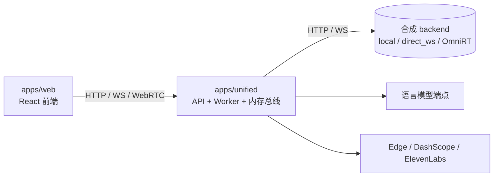
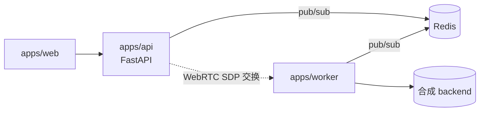

# 部署

OpenTalking 支持三种部署拓扑，按运维复杂度由低到高列出：

1. **单进程（unified）** —— 单 Python 进程，配进程内事件总线，适用于开发与演示。
2. **API 与 Worker 分离** —— 标准生产部署，以 Redis 为事件总线，Worker 进程可横向扩展。
3. **Docker Compose** —— 打包后的部署套件，提供 CPU 与 GPU 两个变种。

## 单进程（unified）

HTTP 与 WebSocket 入口、会话状态、流水线 Worker、事件总线均运行于同一进程，**不依赖
Redis**。

```bash title="终端"
opentalking-unified
# 显式参数等价调用：
python -m apps.unified --host 0.0.0.0 --port 8000
```

适用场景：

- 单机开发。
- 部署负载可在单进程内承载。
- 优先考虑运维简化而非可扩展性。



## API 与 Worker 分离

生产部署拓扑。API 进程承载 HTTP 与 WebSocket 流量，Worker 进程驱动合成流水线，
Redis 作为事件总线在两者之间传递事件。

```bash title="终端：API"
uvicorn apps.api.main:app --host 0.0.0.0 --port 8000
```

```bash title="终端：Worker"
python -m apps.worker.main --host 0.0.0.0 --port 9001
```

```bash title="终端：Redis"
redis-server --port 6379
```

必需环境变量（详见 [配置 §3](configuration.md#3)）：

```env
OPENTALKING_REDIS_URL=redis://localhost:6379/0
OPENTALKING_WORKER_URL=http://127.0.0.1:9001
```



适用场景：

- 多个 Worker 进程共用单个 API 实例。
- 合成负载需独立于 API 进行扩容。
- 要求组件隔离；Worker 故障不影响 API 可用性。

## Docker Compose

仓库提供两份 Compose 文件：

=== "CPU"

    ```bash title="终端"
    docker compose up -d
    ```

    启动的服务：`redis`、`opentalking-api`、`opentalking-worker`、`opentalking-web`。
    无 GPU 时仅 `mock` 合成后端可用，适用于持续集成与前端开发。

=== "GPU"

    ```bash title="终端"
    docker compose -f docker-compose.gpu.yml up -d
    ```

    为 `backend: omnirt` 的模型增加 OmniRT 服务，并为 Worker 容器配置 `nvidia`
    容器运行时。宿主机须安装 NVIDIA Container Toolkit。

仅在使用 `scripts/quickstart/*` 辅助脚本时，日志写入 `~/logs/`、进程 PID 写入
`~/run/`；Docker 部署使用其自带日志驱动。

## 昇腾 910B

专用脚本封装 NPU 部署步骤：

```bash title="终端"
bash scripts/deploy_ascend_910b.sh
```

前置条件：

- CANN 8.0 或更新版本，存在 `/usr/local/Ascend/ascend-toolkit/set_env.sh`。
- OmniRT 仓库与 OpenTalking 仓库处于同级目录。
- 模型检查点位于 `$DIGITAL_HUMAN_HOME/models/`。

具体权重下载与模型启动命令见 [模型端到端部署](model-deployment.md)。

验证部署：

```bash title="终端"
curl -fsS http://127.0.0.1:9000/v1/audio2video/models
# {"models":["wav2lip","flashtalk"]}
```

## 生产部署清单 {#production-checklist}

生产发布前应完成以下事项：

- `OPENTALKING_CORS_ORIGINS` 设置为生产前端 origin。
- 在反向代理（nginx、Caddy 等）终结 TLS；转发 `/`、`/health` 与 `/sessions/{id}/events`。SSE 端点须**关闭**响应缓冲。
- 为位于对称 NAT 后的客户端部署 TURN 服务（如 `coturn`）。
- `OPENTALKING_AVATARS_DIR` 与 `OPENTALKING_VOICES_DIR` 挂载持久化存储。
- 启用 Redis 持久化（`appendonly yes`）；会话状态与声音元数据存储于 Redis。
- 配置结构化日志：将 `OPENTALKING_LOG_LEVEL` 设为 `INFO` 或将 JSON 日志转发至日志聚合系统。
- 配置健康探针：`/healthz` 用于 liveness；`/health` 与 `/queue/status` 联合用于 readiness。
- 启用 CosyVoice 声音复刻时设置 `OPENTALKING_PUBLIC_BASE_URL`；DashScope 须能反向访问服务以获取音频样本。

## 进程管理

仓库提供 shell 辅助脚本，不附带 systemd unit：

| 脚本 | 用途 |
|------|------|
| `scripts/quickstart/start_all.sh` | 启动 unified 与前端，用于开发。 |
| `scripts/quickstart/start_omnirt_wav2lip.sh` | 启动 OmniRT，提供 wav2lip 服务。 |
| `scripts/quickstart/start_omnirt_flashtalk.sh` | 启动 OmniRT，提供 flashtalk 服务。 |
| `scripts/quickstart/status.sh` | 输出已知进程状态。 |
| `scripts/quickstart/stop_all.sh` | 停止 quickstart 辅助脚本启动的进程。 |

生产部署应使用环境匹配的进程管理器（systemd、supervisor、Kubernetes Deployment 等）
封装 API 与 Worker 命令。
